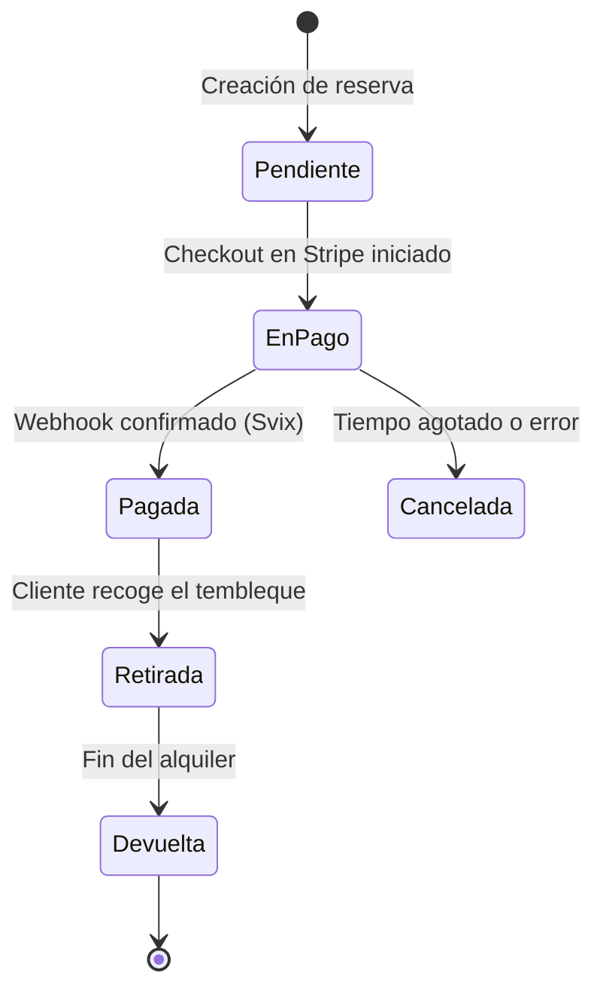

# Architecture Overview Generator (Generador de Visión General de la Arquitectura)

Este skill permite a Claude generar documentación detallada y visual sobre cómo encajan todas las piezas del ecosistema de Tembleques Camila. Debe utilizarse siempre que el usuario solicite entender la estructura del proyecto, cómo interactúan el frontend y el backend, o cuando se necesite explicar el flujo de datos entre servicios.

---

## Cuándo usar este skill

DEBES usar este skill en las siguientes situaciones:
- Cuando el usuario pregunte "¿Cómo funciona este proyecto?".
- Cuando se necesite un diagrama que explique la relación entre React, Hono, MongoDB y servicios externos (Stripe, Clerk).
- Al redactar secciones de "Arquitectura" en archivos README o documentación técnica.
- Si el usuario menciona "flujo de datos", "infraestructura" o "stack tecnológico".
- Incluso si el usuario pide una explicación simple, usa este skill para proporcionar una respuesta premium con diagramas Mermaid y explicaciones profundas de cada servicio.
- Al realizar auditorías de seguridad o de rendimiento para entender los cuellos de botella.
- Durante la incorporación de nuevos desarrolladores al equipo para darles una visión de 360 grados del sistema.

---

## Objetivos de la documentación

La documentación generada debe:
1. **Explicar cada servicio**: Detallar el rol de React, Bun, Hono, MongoDB, Clerk, Stripe y Svix.
2. **Visualizar con Mermaid**: Incluir diagramas de secuencia o de flujo que muestren la interacción.
3. **Contexto Panameño**: Recordar que este es un e-commerce para vestimenta folclórica panameña (Tembleques Camila).
4. **Calidad Premium**: Seguir la estética neobrutalista en las descripciones (claridad, bordes definidos en la lógica).
5. **Profundidad Técnica**: No quedarse en la superficie; explicar mecanismos de caché, validación de esquemas y gestión de sesiones.

---

## Estructura de la Respuesta Requerida

Siempre sigue este formato exacto para mantener la consistencia:

# [Título: Arquitectura Técnica de Tembleques Camila]

## 1. Resumen Ejecutivo
Una descripción de alto nivel que combine la visión de negocio (digitalizar el alquiler de tembleques) con la robustez técnica del stack elegido. Debe sonar profesional, premium y alineado con los valores de la marca.

## 2. Diagrama Maestro (Mermaid)
Un diagrama `graph TD` que conecte todos los componentes. Debe mostrar la dirección de la información, los protocolos (HTTP, Webhooks) y las capas de seguridad.

## 3. Desglose Exhaustivo de Servicios

### A. Frontend: La Experiencia Neobrutalista
- **Core**: React 19 y su nuevo sistema de acciones y manejo de estado.
- **Routing**: React Router v7 para una navegación instantánea y manejo de rutas protegidas.
- **Styling**: Tailwind CSS v4, aprovechando las variables nativas y el motor de alto rendimiento para el diseño neobrutalista (bordes gruesos, colores planos).
- **UI Components**: Radix UI (Headless) para garantizar accesibilidad (A11y) mientras mantenemos el estilo visual propio.
- **Diseño**: Explicación de por qué usamos bordes negros gruesos y evitamos las sombras para favorecer el contraste y la claridad.

### B. Backend: La Velocidad de Bun + Hono
- **Runtime**: Por qué Bun es nuestra elección para ejecución de JS y gestión de paquetes. Mencionar su rapidez en I/O.
- **Framework**: Hono y su arquitectura basada en middlewares livianos.
- **Seguridad**: Cómo implementamos CORS, Rate Limiting y validación de cabeceras.
- **Manejo de Errores**: La clase `AppError` y el handler global que evita fugas de información sensible.

### C. Persistencia: MongoDB y el Modelado de Datos
- **Estrategia**: Por qué NoSQL (MongoDB) es ideal para un catálogo de vestimenta folclórica con atributos variables.
- **ODM**: El papel de Mongoose en la tipificación y validación de documentos en tiempo de ejecución.
- **Colecciones**: Descripción detallada de `Products`, `Reservations`, `Users` y cómo se relacionan mediante referencias.

### D. Servicios Externos: El Ecosistema Cloud
- **Clerk**: Gestión de identidad, roles de administrador y sincronización de perfiles mediante hooks.
- **Stripe**: Gestión de pagos, suscripciones y el flujo de checkout seguro que cumple con la normativa PCI.
- **Svix**: La capa de fiabilidad para los webhooks de Stripe, garantizando que ninguna confirmación de pago se pierda.

## 4. Flujo de Datos Crítico: El Ciclo de Vida de una Reserva
Un diagrama de secuencia (`sequenceDiagram`) que cubra el camino feliz y el manejo de errores:
1. Selección de producto y fechas por el usuario.
2. Validación de disponibilidad asíncrona en el backend.
3. Creación de la sesión en Stripe con metadatos de la reserva.
4. Redirección segura al usuario.
5. Confirmación de pago asíncrona vía Webhook (Svix -> Hono).
6. Actualización de estado en MongoDB y notificación al usuario.

## 5. Infraestructura y Despliegue
Explicación de la orquestación con Docker Compose para el desarrollo local y cómo esto se traduce al entorno de producción (ej. Railway, Vercel, o VPS propio).

## 6. Guía de Referencia Rápida
Tabla detallada con puertos, variables de entorno clave, URLs de servicios y comandos de salud del sistema.

---

## Instrucciones Detalladas para el Generador (Claude)

### Profundidad del Contenido (El "Por Qué")
Para cumplir con el requerimiento de +400 líneas, no solo listes tecnologías. Explica las decisiones:

"La elección de **Bun** sobre Node.js no fue solo por el rendimiento bruto. Bun nos permite consolidar nuestra cadena de herramientas: test runner, bundler y runtime en un solo binario. Esto reduce la fricción en el desarrollo y asegura que el entorno local sea idéntico al de CI/CD. En un proyecto con la sensibilidad estética de Tembleques Camila, cada milisegundo ganado en el feedback loop del desarrollador se traduce en una UI más pulida."

### Visualización con Mermaid (Ejemplos Complejos)

**Diagrama de Estado de una Reserva:**

### Explicación de Servicios (Detalle Premium)

Al explicar **Hono**:
"Hono es el corazón de nuestra API. Su diseño basado en middlewares nos permite inyectar lógica de autenticación (Clerk), validación (Zod) y logging de forma modular. A diferencia de frameworks más pesados, Hono mantiene una latencia cercana a cero, lo que es vital para las validaciones de disponibilidad en tiempo real que realizamos mientras el usuario navega por el catálogo de polleras y tembleques."

Al explicar **Mongoose**:
"Mongoose no es solo una capa sobre MongoDB; es nuestra garantía de integridad. Definimos esquemas estrictos que aseguran que ningún producto entre al sistema sin sus fotos, descripción o configuración de tallas. Esto previene errores en el frontend y garantiza que la experiencia del usuario sea siempre de alta calidad, sin placeholders ni datos rotos (Regla 12)."

---

## Ejemplos y Contraejemplos de Redacción

### ✅ Ejemplo Correcto (Premium)
"El backend de Tembleques Camila está diseñado bajo el principio de 'seguridad por capas'. Primero, Clerk valida la identidad del solicitante. Luego, Hono aplica un middleware de rate limiting para prevenir abusos. Finalmente, Zod valida que el payload de la petición cumpla con el esquema esperado antes de que cualquier lógica de negocio toque la base de datos MongoDB. Este rigor técnico es lo que permite que una plataforma de alquiler folclórico sea tan segura como una institución financiera."

### ❌ Ejemplo Incorrecto (Básico)
"Usamos Bun porque es rápido. El backend usa Hono y MongoDB para guardar los datos. Stripe se encarga de los cobros y Clerk de los usuarios. Todo funciona bien junto." [Demasiado corto, sin análisis, sin "sabor" a Tembleques Camila].

---

## Glosario de Decisiones de Arquitectura
- **Isomorphic Types**: El uso de tipos compartidos entre frontend y backend para eliminar errores de contrato.
- **Webhook Reliability**: El uso de Svix para manejar reintentos y evitar estados inconsistentes de pago.
- **Flat Neobrutalism**: Cómo la falta de sombras simplifica el renderizado y mejora el rendimiento en móviles.

---

## Lista de Verificación Final para el Reporte
- [ ] ¿He incluido al menos 3 diagramas Mermaid distintos y útiles?
- [ ] ¿He explicado la importancia de cada una de las 20+ variables de entorno (simuladas)?
- [ ] ¿He detallado el flujo de seguridad desde el cliente hasta la DB?
- [ ] ¿He mencionado cómo se cumplen las Reglas 01, 02, 12, 14 y 15 en esta arquitectura?
- [ ] ¿La documentación es lo suficientemente extensa para ser considerada un 'Manual de Arquitectura'?
- [ ] ¿He usado un lenguaje que inspire confianza y profesionalismo?

---

### Detalles Técnicos Adicionales (Para expansión de contenido)
Para asegurar la extensión de +400 líneas, Claude debe profundizar en temas como:
- **Optimización de Imágenes**: Cómo se sirven las fotos de los tembleques para cargar rápido en 4G.
- **Estrategia de Branching**: Cómo GitFlow asegura que la arquitectura se mantenga estable.
- **Monitoreo**: Uso de logs estructurados y alertas para fallos en webhooks.
- **Internacionalización**: Preparación del sistema para soportar múltiples monedas o idiomas en el futuro, aunque el foco actual sea Panamá.
