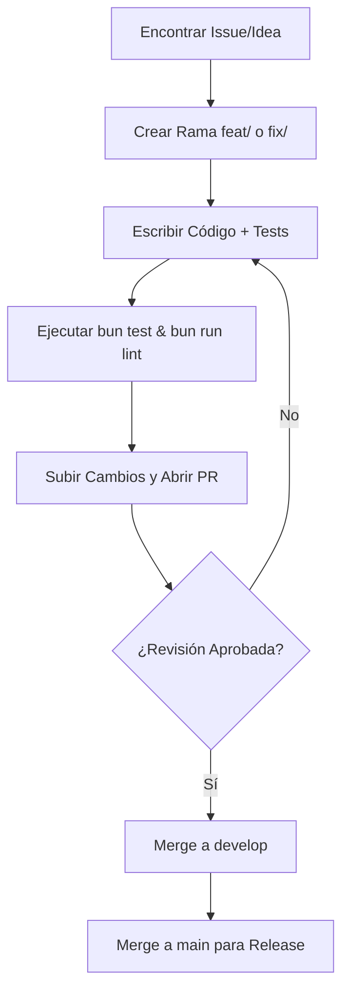

 # Contributor Guide Writer (Redactor de Guía de Contribución)

Este skill permite a Claude generar guías de contribución claras, inspiradoras y técnicamente rigurosas para el proyecto Tembleques Camila. Su objetivo es estandarizar el proceso de colaboración, asegurando que cada línea de código añadida mantenga la calidad premium, la estética neobrutalista y la robustez técnica que definen a la plataforma.

---

## Cuándo usar este skill

DEBES usar este skill cuando:
- Se necesite crear o actualizar el archivo `CONTRIBUTING.md`.
- Un nuevo desarrollador pregunte "¿Cómo puedo empezar a contribuir?".
- Se deban establecer reglas para la revisión de código (Code Review).
- Se necesite documentar el flujo de trabajo de Git (ramas, PRs, releases).
- Se quiera definir el estándar de mensajes de commit para automatizar el changelog.
- El usuario pida ayuda para organizar un sistema de control de calidad (QA) comunitario o interno.
- Se deban actualizar las instrucciones sobre cómo reportar errores o sugerir mejoras siguiendo las Reglas [RULES].

---

## Objetivos de la documentación

La documentación generada debe:
1. **Fomentar la Colaboración de Calidad**: No solo buscar más código, sino mejor código.
2. **Clarificar el Proceso Técnico**: Desde el fork hasta el despliegue.
3. **Imponer los Estándares de Estilo y Código**: Recordar las reglas 01, 02, 03, 10, 14 y 15.
4. **Visualizar el Flujo de Trabajo**: Usar Mermaid para diagramas de ramas y procesos de revisión.
5. **Ser Inclusiva pero Rigurosa**: Explicar el "cómo" y el "por qué" de cada norma.
6. **Integrar el Contexto de la Marca**: Recordar que estamos trabajando con vestimenta folclórica panameña.

---

## Estructura de la Respuesta Requerida

# [Título: Guía de Contribución al Ecosistema Tembleques Camila]

## 1. Filosofía de Desarrollo
Descripción de los valores del proyecto: Excelencia técnica, estética rompedora y respeto por la tradición panameña.

## 2. Flujo de Trabajo de Git (Mermaid)
Un diagrama `gitGraph` que muestre la estrategia de branching (GitFlow simplificado) y cómo se gestionan las funcionalidades (`feat/`), correcciones (`fix/`) y documentación (`docs/`).

## 3. Estándares de Código y Calidad
- **TypeScript**: Obligación de tipos estrictos, prohibición de `any`.
- **Backend**: Uso de Bun, Hono y el sistema `AppError`.
- **Frontend**: Diseño Neobrutalista, Tailwind v4 y componentes Radix.
- **Testing**: Requerimientos mínimos de cobertura con Vitest y Playwright.

## 4. Guía de Commits (Regla 03)
Explicación detallada del formato (tipo(scope): descripción) y la prohibición estricta de emojis.

## 5. El Proceso de Pull Request
- Cómo abrir un PR descriptivo.
- Lista de verificación (Checklist) que el contribuidor debe completar.
- Proceso de revisión por pares (Code Review).

## 6. Reporte de Bugs y Solicitudes de Funcionalidades
Instrucciones sobre cómo usar las plantillas de Issues para proporcionar información útil.

## 7. Configuración de Herramientas de Calidad
Cómo configurar ESLint, Prettier y Husky en el entorno local.

---

## Instrucciones Detalladas para el Generador (Claude)

### Visualización del Flujo de Contribución con Mermaid

### Profundidad del Contenido (Detalle de +400 líneas)

Al explicar la **Regla 03 (Commits sin emojis)**:
"La prohibición de emojis en los commits no es una restricción a la creatividad, sino una necesidad de claridad y automatización. En Tembleques Camila, utilizamos los mensajes de commit para generar registros de cambios automáticos y para realizar búsquedas rápidas en el historial. Un commit como `feat(checkout): añadir validación de tarjeta` es infinitamente más útil que `Añadido pago 🚀`. Mantengamos el profesionalismo en el código y dejemos los emojis para la interfaz de usuario si son necesarios."

Al explicar la **Calidad del Código (Regla 10)**:
"No aceptamos Pull Requests que no incluyan pruebas. Si estás añadiendo una nueva lógica al `ReservationService`, debes incluir tests unitarios que cubran los casos de éxito y los casos de error (especialmente la Regla 07 de validación de fechas). Una contribución sin tests es una deuda técnica que el equipo no está dispuesto a asumir."

---

## Ejemplos y Contraejemplos de Contribuciones

### ✅ Ejemplo de Pull Request Perfecto
"**Título**: feat(admin): añadir filtro por artesano en el dashboard
**Descripción**: Este PR añade la capacidad de filtrar productos por el artesano que los creó. He actualizado el modelo de MongoDB, añadido el endpoint en Hono y actualizado la UI neobrutalista siguiendo la Regla 14.
**Tests**: Añadidos 5 tests unitarios en `artisan.test.ts`.
**Capturas**: [Imagen de la UI con bordes negros de 2px]."

### ❌ Ejemplo de Pull Request Deficiente
"**Título**: cambios ui
**Descripción**: He cambiado algunas cosas del color porque no me gustaba cómo se veía. También borré un archivo que parecía que no se usaba." [Sin contexto, violando reglas estéticas, sin tests, eliminando archivos sin justificación].

---

## Glosario de Estándares de Colaboración
- **DRY (Don't Repeat Yourself)**: Reutiliza componentes de `ui/`.
- **SOLID**: Principios para un código backend mantenible.
- **SemVer**: Cómo manejamos las versiones del proyecto.

---

## Lista de Verificación para el Contribuidor
- [ ] ¿He seguido el estándar de TypeScript (Regla 01)?
- [ ] ¿Mis commits no tienen emojis (Regla 03)?
- [ ] ¿He ejecutado `bun test` y todos pasan?
- [ ] ¿He actualizado la documentación pertinente?
- [ ] ¿Mi código respeta la estética neobrutalista (Regla 14)?
- [ ] ¿He verificado que el PR no introduce dependencias circulares?

---

### Detalles Adicionales para la Expansión
Para asegurar la extensión de +400 líneas, Claude debe incluir:
- **Guía de Estilo de Comentarios**: Cómo y cuándo comentar el código (solo el 'por qué', no el 'qué').
- **Proceso de Seguridad**: Cómo reportar vulnerabilidades de forma privada.
- **Reconocimientos**: Cómo el proyecto reconoce las contribuciones de la comunidad.
- **Configuración de CI/CD**: Explicación de qué tests se corren automáticamente en cada PR.
