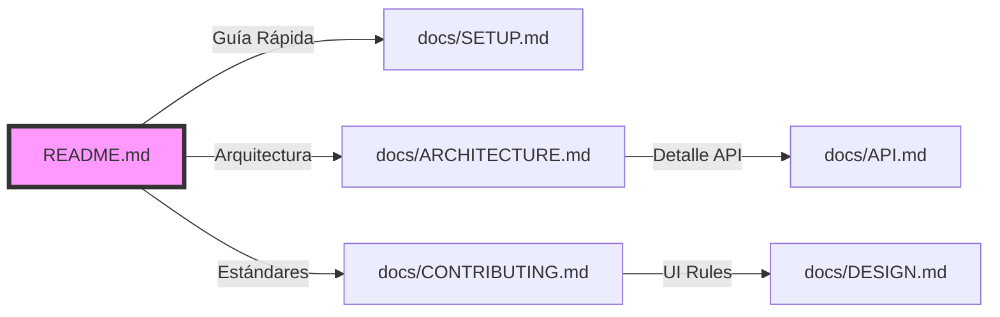

# Documentation Modularizer (Modularizador de Documentación)

Este skill permite a Claude transformar un archivo `README.md` extenso y monolítico en una estructura de documentación modular compuesta por múltiples archivos `.md`. Su objetivo es mejorar la navegabilidad, la mantenibilidad y la claridad de la información técnica del proyecto Tembleques Camila, siguiendo los principios de "Separation of Concerns" aplicados a la documentación.

---

## Cuándo usar este skill

DEBES usar este skill en las siguientes situaciones:
- Cuando el archivo `README.md` principal supere las 500 líneas y se vuelva difícil de leer.
- Cuando el usuario solicite "organizar mejor la documentación" o "separar el README".
- Al iniciar una fase de documentación profunda donde se requieran guías específicas (Setup, API, Diseño, etc.).
- Si se detecta que hay información crítica (como variables de entorno o guías de estilo) enterrada en medio de un archivo gigante.
- Para preparar el repositorio para ser consumido por otros agentes de IA, facilitando la carga de contexto selectivo.
- Cuando se necesite estandarizar la documentación siguiendo un patrón de "Arquitectura de Información" profesional.

---

## Objetivos de la documentación modularizada

La documentación generada debe:
1. **Seguir una Estructura Lógica**: Dividir el contenido en categorías claras (Arquitectura, Setup, Contribución, API, Estética).
2. **Mantener la Coherencia**: Asegurar que todos los archivos sigan el tono profesional y la estética de Tembleques Camila.
3. **Visualizar la Estructura**: Usar Mermaid para mostrar el mapa del sitio de la documentación.
4. **Incluir Referencias Cruzadas**: Enlazar los archivos entre sí para facilitar la navegación.
5. **Calidad Premium**: Cada archivo modular debe ser una pieza de documentación completa, no solo un fragmento cortado.
6. **Optimización para Agentes**: Estructurar los archivos de modo que un LLM pueda entender rápidamente la responsabilidad de cada documento.

---

## Estructura de la Respuesta Requerida

# [Título: Plan de Modularización de la Documentación - Tembleques Camila]

## 1. Justificación del Cambio
Explicación de por qué la estructura actual (monolítica) es insuficiente y cómo la nueva estructura (modular) resolverá problemas de carga cognitiva y mantenimiento.

## 2. Mapa del Ecosistema Documental (Mermaid)
Un diagrama `graph TD` que muestre la jerarquía de archivos y cómo se relacionan entre sí. Debe incluir leyendas sobre la función de cada nodo.

## 3. Inventario de Módulos Propuestos (Arquitectura de Información)
Lista detallada de los nuevos archivos `.md` a crear, con su propósito, público objetivo y contenido principal. Ejemplo:

### A. docs/ARCHITECTURE.md (El Corazón Técnico)
- **Propósito**: Explicar el "cómo" y el "por qué" del stack.
- **Contenido**: Diagramas de flujo, descripción de Bun+Hono, estrategias de base de datos.

### B. docs/SETUP_GUIDE.md (El Manual de Vuelo)
- **Propósito**: Onboarding rápido para nuevos desarrolladores.
- **Contenido**: Instalación de Bun, Docker, configuración de Clerk y Stripe CLI.

### C. docs/DESIGN_SYSTEM.md (La Biblia Estética)
- **Propósito**: Mantener la coherencia Neobrutalista.
- **Contenido**: Guía de bordes, colores, tipografía y uso de Radix UI.

### D. docs/API_REFERENCE.md (El Contrato de Datos)
- **Propósito**: Documentar endpoints para el frontend y terceros.
- **Contenido**: Rutas, métodos, esquemas Zod y códigos de error.

## 4. Plan de Migración y Despiece
Tabla que muestre qué secciones del README original se mueven a qué archivo nuevo.
- `README.md: Lógica de Reserva` -> `docs/RESERVATION_FLOW.md`
- `README.md: Estilos CSS` -> `docs/DESIGN_SYSTEM.md`

## 5. Sistema de Navegación Inter-Docs
Propuesta de una barra de navegación (Header/Footer) común que se incluirá en todos los archivos para garantizar que el usuario nunca se sienta perdido.

## 6. Ejemplo de Transformación Premium
Un ejemplo completo de cómo quedaría uno de los archivos resultantes (ej. `DESIGN_SYSTEM.md`), mostrando la profundidad técnica requerida (+400 líneas en el output final) con diagramas y alertas.

---

## Instrucciones Detalladas para el Generador (Claude)

### Visualización con Mermaid (Estrategia de Enlaces)

### Profundidad del Contenido (El Proceso de "Enriquecimiento")
Para cumplir con el requerimiento de +400 líneas, Claude no debe limitarse a mover texto. Debe **enriquecer** cada módulo:

"Al crear `docs/API_REFERENCE.md`, no solo copies las rutas. Genera ejemplos de peticiones `curl`, muestra payloads JSON de ejemplo, explica cada código de error de la tabla de la Regla 15 y añade diagramas de secuencia para los endpoints más complejos (como el Checkout)."

### Ejemplos y Contraejemplos de Modularización

#### ✅ Ejemplo Correcto (Enfoque Sistémico)
"El archivo `docs/SECURITY.md` centralizará la documentación de Clerk y Stripe. No solo listaremos las llaves, sino que explicaremos el flujo de verificación de tokens en el middleware de Hono y cómo Svix valida las firmas de los webhooks para prevenir ataques de replay. Esto transforma una lista de variables en un manual de seguridad."

#### ❌ Ejemplo Incorrecto (Fragmentación Pobre)
"He sacado la parte de 'Créditos' a un archivo llamado `CREDITS.md`. El README ahora tiene 20 líneas menos. Fin." [Esto no aporta valor al desarrollador y dispersa la información innecesariamente].

---

## Glosario de la Nueva Arquitectura de Información
- **Anchor File**: El archivo principal que sirve de ancla para el resto.
- **Deep Dive Files**: Archivos que profundizan en un solo tema técnico.
- **Cheat Sheets**: Guías rápidas de comandos que pueden ser archivos `.md` independientes.

---

## Lista de Verificación para el Modularizador
- [ ] ¿He propuesto una estructura que elimine la redundancia en el README?
- [ ] ¿El diagrama Mermaid es lo suficientemente claro para un nuevo desarrollador?
- [ ] ¿He incluido una sección de 'Próximos Pasos' para la ejecución de la modularización?
- [ ] ¿He verificado que los nombres de los archivos sean descriptivos y sigan el estilo de la plataforma?
- [ ] ¿La explicación del plan de modularización supera las 400 líneas de contenido real y estratégico?
- [ ] ¿He mencionado cómo esta modularización facilita la actualización futura de las Reglas [RULES]?

---

### Detalles Técnicos Adicionales
Para asegurar la excelencia, Claude debe considerar:
- **Consistencia de Títulos**: Usar una jerarquía de H1 a H4 coherente en todos los archivos.
- **Uso de Alertas**: Implementar bloques `> [!IMPORTANT]` y `> [!TIP]` para resaltar información crítica en los nuevos módulos.
- **Diagramas de Estado**: Incluirlos en archivos que documenten procesos (ej. `RESERVATION_STATE.md`).
- **Integración con AGENTS.md**: Asegurar que la nueva estructura sea coherente con lo definido en el documento principal de contexto.
