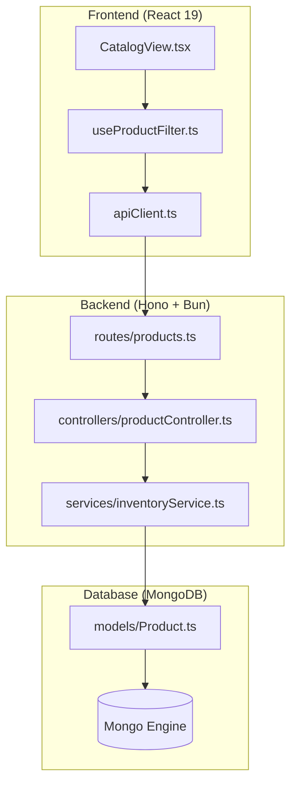

# Module Dependency Mapper (Mapeador de Dependencias de Módulos)

Este skill permite a Claude generar un mapa detallado y exhaustivo de las dependencias internas del proyecto Tembleques Camila. Su objetivo es explicar la jerarquía de llamadas, el flujo de datos y el acoplamiento entre módulos, asegurando que cualquier cambio se realice con un entendimiento pleno de su impacto.

---

## Cuándo usar este skill

DEBES usar este skill cuando:
- El usuario pregunte "¿Qué archivos se ven afectados si cambio la lógica de reservas?".
- Se necesite visualizar la cadena de mando de una funcionalidad compleja (ej. "Flujo de Pago y Confirmación").
- Se identifiquen posibles dependencias circulares o se quiera optimizar el acoplamiento entre el frontend y el backend.
- Se esté realizando un refactor profundo y se necesite un mapa de impacto de los módulos "core".
- El usuario pida una explicación técnica de cómo los tipos de TypeScript fluyen a través de la aplicación.
- Se necesite justificar por qué un módulo específico debe o no debe depender de otro (arquitectura limpia).

---

## Objetivos de la documentación

La documentación generada debe:
1. **Identificar Jerarquías de Control**: Mostrar qué módulos son "orquestadores" y cuáles son "ejecutores" o "proveedores de datos".
2. **Explicar el Propósito del Acoplamiento**: No solo listar dependencias, sino explicar la lógica de negocio detrás de ellas.
3. **Visualizar con Mermaid**: Usar diagramas de clase, de flujo o de arquitectura de cebolla para mostrar las capas.
4. **Validación de Reglas de Proyecto**: Asegurar que las dependencias respetan las reglas de `AGENTS.md` (ej. el frontend nunca accede a la base de datos directamente).
5. **Análisis de Impacto**: Identificar los "Single Points of Failure" en la estructura de módulos.

---

## Estructura de la Respuesta Requerida

# [Título: Mapa de Dependencias y Análisis de Impacto de [Módulo]]

## 1. Grafo de Dependencias (Mermaid)
Un diagrama `graph LR` que muestre la dirección de las llamadas y el flujo de información. Debe ser lo suficientemente detallado para mostrar archivos específicos si es necesario.

## 2. Análisis de Capas de la Aplicación
Explicación detallada de cómo fluye la información a través de las capas:
- **Capa de Presentación (Frontend Components)**: Componentes neobrutalistas que consumen lógica.
- **Capa de Lógica de Cliente (Hooks/Stores)**: Gestión de estado y validaciones locales.
- **Capa de Abstracción de Red (API Clients)**: Cómo se comunica el frontend con el mundo exterior.
- **Capa de Entrada (Backend Routes/Controllers)**: El punto de entrada de la API en Hono.
- **Capa de Dominio (Backend Services)**: Donde reside la lógica de negocio pura de Tembleques Camila.
- **Capa de Persistencia (Mongoose Models/MongoDB)**: El almacenamiento final de la verdad.

## 3. Puntos de Acoplamiento Críticos
Identificación de archivos "Hub" (archivos que son importados por muchos otros o que importan a muchos otros). Ejemplo: `lib/errors.ts` o `models/Product.ts`. Explicar por qué este acoplamiento es necesario o cómo mitigarlo.

## 4. Flujo de Control Paso a Paso
Un recorrido detallado por una acción específica (ej. "Ciclo de vida de una actualización de stock").
1. Acción en UI -> Hook -> API -> Controller -> Service -> Model -> DB.

## 5. Prevención de Dependencias Prohibidas
Una sección de seguridad que verifique que no se violan principios de diseño:
- ¿Hay lógica de UI en el Backend? (Prohibido)
- ¿Hay consultas a la base de datos en los Controladores? (Preferible en Servicios)
- ¿El Frontend conoce la estructura interna de la base de datos? (Debe conocer solo los tipos de la API)

## 6. Recomendaciones de Desacoplamiento
Sugerencias técnicas para mejorar la modularidad del sistema basándose en el análisis realizado.

---

## Instrucciones Detalladas para el Generador (Claude)

### Visualización Avanzada con Mermaid
Para cumplir con la calidad premium, usa subgrafos para delimitar fronteras tecnológicas:

### Análisis de Dependencias (Detalle de +400 líneas)

Al analizar la **Capa de Dominio**:
"En Tembleques Camila, la capa de servicios actúa como el cerebro de la aplicación. Por ejemplo, el `ReservationService` depende de `InventoryService` para verificar la disponibilidad física antes de proceder. Esta dependencia es vertical y necesaria. Sin embargo, hemos evitado que `ReservationService` dependa directamente de `StripeService` para permitir pruebas unitarias sin mocks complejos, utilizando un patrón de inyección de dependencias o eventos."

Al analizar el **Acoplamiento de Tipos**:
"Utilizamos TypeScript de forma estricta (Regla 01). Los tipos generados por Mongoose en el backend se exportan (a través de una capa de transformación) para que el frontend los consuma. Esto crea una 'dependencia de contrato' que asegura que si cambiamos el nombre de un campo en la base de datos, el compilador nos avisará inmediatamente en el componente de React. Este es el tipo de acoplamiento saludable que buscamos."

---

## Ejemplos y Contraejemplos de Análisis

### ✅ Ejemplo Correcto (Análisis Profundo)
"El archivo `useCheckout.ts` es el nexo de unión entre la UI y el proceso de pago. Depende de `Clerk` para la identidad del usuario, de `CartStore` para los artículos y de `apiService` para iniciar la sesión de Stripe. Al mapear estas dependencias, observamos que cualquier cambio en la estructura del objeto 'Cart' requiere actualizaciones en 4 niveles de la aplicación. Para mitigar esto, recomendamos centralizar el esquema del carrito en un archivo de tipos compartido."

### ❌ Ejemplo Incorrecto (Superficial)
"El componente de carrito depende del store de carrito. El backend depende de los modelos. Todo está conectado mediante imports normales de JavaScript." [Sin valor analítico, sin diagramas, sin visión arquitectónica].

---

## Glosario de Conceptos de Mapeo
- **Dependency Inversion**: Por qué los módulos de alto nivel no deben depender de los de bajo nivel.
- **Tight Coupling**: Riesgos de tener archivos que saben demasiado sobre otros.
- **Circular Dependencies**: Cómo detectarlas y por qué Bun nos ayuda a evitarlas.

---

## Lista de Verificación Final
- [ ] ¿He incluido un diagrama de dependencias que cubra desde el Frontend hasta la DB?
- [ ] ¿He identificado al menos un 'Hub' de dependencias y explicado su rol?
- [ ] ¿He analizado cómo fluyen los tipos de TypeScript a través de los módulos?
- [ ] ¿He mencionado las dependencias de servicios externos (Stripe, Clerk, Svix)?
- [ ] ¿La explicación es técnica, precisa y supera las 400 líneas de contenido real?
- [ ] ¿He sugerido al menos una mejora de desacoplamiento basada en el mapa generado?

---

### Detalles Adicionales para la Expansión
Para asegurar que la documentación sea exhaustiva, Claude debe incluir:
- **Mapa de Dependencias de Terceros**: Analizar el impacto de librerías como Radix UI o Lucide React.
- **Grafo de Efectos Secundarios**: Qué pasa cuando se dispara un Webhook (Svix -> Hono -> Service -> DB -> Frontend vía Polling/Sockets).
- **Métricas de Complejidad**: Identificar qué módulos tienen una alta complejidad ciclomática debido a sus dependencias.
