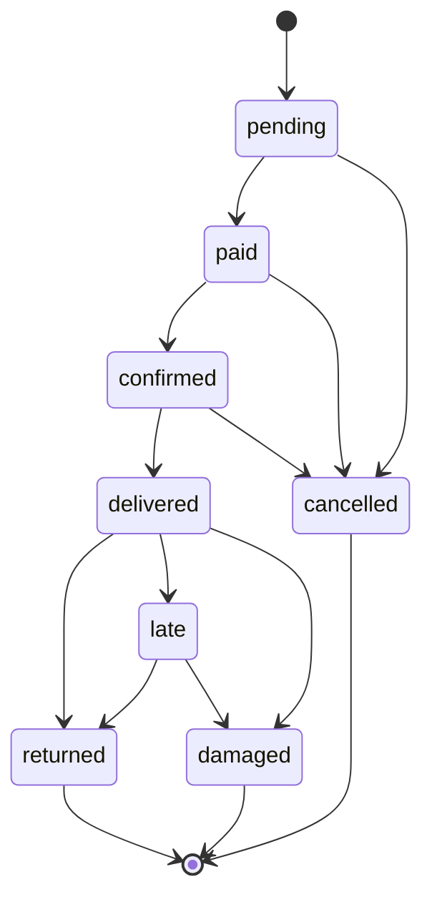

# Tembleques Camila

Plataforma web de alquiler de vestimenta tipica panamena y accesorios folcloricos. Permite a clientes explorar el catalogo, reservar productos por fechas, aceptar terminos de uso y pagar en linea. Incluye un panel de administracion separado para gestionar inventario, reservas y usuarios.

---

## Descripcion del Proyecto

Tembleques Camila digitaliza el proceso de alquiler de vestimenta tipica panamena (polleras, vestuario masculino, trajes infantiles, tembleques y accesorios) que tradicionalmente se gestionaba de forma manual.

### Modelo de Negocio

El sistema funciona bajo un esquema de **alquiler por fechas**. El cliente selecciona un producto, elige un rango de fechas, acepta los terminos de responsabilidad sobre el articulo y paga en linea mediante Stripe. Cada pieza puede ser alquilada multiples veces, generando ingresos recurrentes sobre un inventario reutilizable.

### Categorias de Productos

- Polleras (montuna y de gala)
- Vestuario masculino tipico
- Vestuario infantil
- Tembleques artesanales
- Accesorios (peinetas, cadenas, joyeria)
- Paquetes completos para eventos

---

## Arquitectura

El sistema esta dividido en tres servicios independientes, todos orquestados mediante Docker Compose:

```
parcial-dsix/
  docker-compose.yml       # Orquestacion de los 3 servicios
  .env                     # Variables de entorno
  backend/                 # API REST (Bun + Hono + MongoDB)
  frontend/                # Interfaz web (React + Vite + shadcn/ui)
```

### Diagrama de Servicios


### Stack Tecnologico

| Capa | Tecnologia |
|---|---|
| **Frontend** | React 19, React Router 7, Vite 6 |
| **UI** | TailwindCSS v4, shadcn/ui, Lucide Icons |
| **Tema** | OKLCH Neobrutalista (variables CSS en `index.css`) |
| **Backend** | Bun runtime, Hono framework |
| **Validacion** | Zod |
| **Base de Datos** | MongoDB 7 via Mongoose |
| **Autenticacion** | JWT (jsonwebtoken + bcryptjs) |
| **Pagos** | Stripe Checkout Sessions |
| **Contenedores** | Docker + Docker Compose |

---

## Como Funciona

### Flujo del Cliente

1. El usuario explora el catalogo y filtra por categoria, talla o precio.
2. Selecciona un producto y ve su disponibilidad.
3. Elige fechas de inicio y devolucion.
4. Lee y acepta los terminos y condiciones mediante un checkbox obligatorio — el boton de pago permanece deshabilitado hasta la aceptacion.
5. Se registra la aceptacion en base de datos con timestamp, IP y user agent.
6. Paga mediante Stripe Checkout. En modo demo (sin clave real de Stripe), el pago se simula automaticamente.
7. Recibe una pantalla de confirmacion con los detalles de la reserva.

### Flujo del Administrador

El panel de administracion vive en `/admin` y es completamente independiente del sitio cliente. Requiere una cuenta con rol `admin`.

- **Dashboard**: KPIs en tiempo real (reservas activas, ingresos del mes, proximas devoluciones, alertas de danos).
- **Inventario**: CRUD completo de productos. Crear, editar, marcar como disponible/en mantenimiento, eliminar.
- **Reservas**: Ver todas las reservas con filtros por estado. Avanzar el ciclo de vida: Pendiente → Pagado → Confirmado → Entregado → Devuelto.
- **Usuarios**: Lista de clientes con historial expandible de alquileres por cliente.

### Estados de una Reserva



### Proteccion contra Doble Reserva

El backend valida disponibilidad en el momento de crear la sesion de Stripe, no solo al crear la reserva. Esto previene condiciones de carrera donde dos usuarios podrian reservar el mismo producto para las mismas fechas de forma concurrente.

---

## Base de Datos

Cuatro colecciones en MongoDB:

| Coleccion | Proposito |
|---|---|
| `users` | Clientes y administradores. Indice unico en `email`. |
| `products` | Catalogo con stock, categoria, precio y imagenes. Indices en `category`, `stock`, `condition_status`. |
| `rentals` | Reservas con estado, fechas y referencia al pago de Stripe. Indice compuesto en `product_id`, `start_date`, `end_date`. |
| `termsacceptances` | Registro de aceptacion de terminos por reserva (timestamp, IP, user agent). |

---

## Inicio Rapido

### Requisitos

- Docker Desktop instalado y corriendo
- Git

### 1. Clonar y configurar

```bash
git clone <repo-url>
cd parcial-dsix

# Copiar las variables de entorno
cp .env.example .env
```

### 2. Levantar el sistema

```bash
docker compose up --build
```

Este comando construye las imagenes de frontend y backend, espera a que MongoDB este listo (health check), ejecuta el seed automatico y levanta los tres servicios.

### 3. Acceder

| Servicio | URL |
|---|---|
| Sitio web (cliente) | http://localhost:5173 |
| Panel administrador | http://localhost:5173/admin |
| API REST | http://localhost:3000 |

### Cuentas Precargadas

| Rol | Email | Contrasena |
|---|---|---|
| Administrador | `admin@tembleques.com` | `admin123` |
| Cliente demo | `cliente@demo.com` | `demo123` |

### Comandos Utiles

```bash
# Ver logs en tiempo real
docker compose logs -f

# Ver logs de un servicio especifico
docker compose logs -f backend
docker compose logs -f frontend

# Detener los contenedores
docker compose down

# Detener y borrar la base de datos (reset completo)
docker compose down -v

# Reiniciar un servicio especifico
docker compose restart backend
```

---

## Variables de Entorno

| Variable | Descripcion | Default |
|---|---|---|
| `MONGO_URI` | URI de conexion a MongoDB | `mongodb://mongodb:27017/tembleques_camila` |
| `JWT_SECRET` | Clave secreta para firmar tokens JWT | Cambiar en produccion |
| `STRIPE_SECRET_KEY` | Clave secreta de Stripe (modo test) | Placeholder (activa modo demo) |
| `STRIPE_WEBHOOK_SECRET` | Clave para validar webhooks de Stripe | Placeholder |
| `VITE_API_URL` | URL de la API desde el frontend | `http://localhost:3000` |

---

## Estructura del Codigo

```
backend/src/
  index.ts                  # Servidor Hono, rutas montadas, arranque
  db.ts                     # Conexion MongoDB con reintentos
  seed.ts                   # Datos iniciales (admin + 12 productos)
  models/
    User.ts                 # Schema de usuarios con roles
    Product.ts              # Schema de productos con categorias
    Rental.ts               # Schema de reservas con 8 estados
    TermsAcceptance.ts      # Registro de aceptacion de terminos
  routes/
    auth.ts                 # POST /register, POST /login, GET /me
    products.ts             # GET / (filtros), GET /:id, GET /:id/availability
    rentals.ts              # POST /, GET /my, GET /:id
    admin.ts                # Dashboard, CRUD productos, gestion reservas
    stripe.ts               # Checkout session, webhook
  middleware/
    auth.ts                 # Verificacion JWT, guard de admin
  services/
    availability.ts         # Validacion de solapamiento de fechas
    rental.ts               # Calculo de totales, creacion, transiciones de estado

frontend/src/
  index.css                 # Tema OKLCH neobrutalista (fuente de verdad de estilos)
  main.tsx                  # Entry point
  App.tsx                   # Router y rutas protegidas
  hooks/
    useAuth.tsx             # Contexto de autenticacion JWT con localStorage
  services/
    api.ts                  # Capa de acceso a todos los endpoints del backend
  components/
    ui/                     # Componentes shadcn/ui adaptados al tema
    layouts/
      ClientLayout.tsx      # Navbar + Footer para el sitio publico
      AdminLayout.tsx       # Sidebar para el panel de administracion
  pages/
    Landing.tsx             # Pagina principal con hero, catalogo, FAQ
    Catalog.tsx             # Grid de productos con busqueda y filtros
    ProductDetail.tsx       # Detalle de producto con galeria
    Checkout.tsx            # Flujo de reserva con terminos obligatorios
    Confirmation.tsx        # Pantalla de exito post-pago
    Login.tsx               # Inicio de sesion
    Register.tsx            # Registro de cuenta
    Profile.tsx             # Perfil y historial de reservas
    admin/
      Dashboard.tsx         # KPIs y alertas
      Inventory.tsx         # CRUD de productos
      Reservations.tsx      # Gestion de reservas con transiciones
      Users.tsx             # Lista de clientes con historial
```

---

## API Endpoints

| Metodo | Ruta | Auth | Descripcion |
|---|---|---|---|
| `POST` | `/api/auth/register` | No | Registro de usuario |
| `POST` | `/api/auth/login` | No | Inicio de sesion |
| `GET` | `/api/auth/me` | JWT | Usuario autenticado |
| `GET` | `/api/products` | No | Catalogo con filtros |
| `GET` | `/api/products/:id` | No | Detalle de producto |
| `GET` | `/api/products/:id/availability` | No | Fechas ocupadas |
| `POST` | `/api/rentals` | JWT | Crear reserva |
| `GET` | `/api/rentals/my` | JWT | Mis reservas |
| `GET` | `/api/rentals/:id` | JWT | Detalle de reserva |
| `POST` | `/api/stripe/create-checkout-session` | JWT | Iniciar pago |
| `POST` | `/api/stripe/webhook` | No | Confirmar pago |
| `GET` | `/api/admin/dashboard` | Admin | KPIs |
| `POST` | `/api/admin/products` | Admin | Crear producto |
| `PUT` | `/api/admin/products/:id` | Admin | Editar producto |
| `DELETE` | `/api/admin/products/:id` | Admin | Eliminar producto |
| `GET` | `/api/admin/rentals` | Admin | Todas las reservas |
| `PATCH` | `/api/admin/rentals/:id/status` | Admin | Cambiar estado |
| `GET` | `/api/admin/users` | Admin | Lista de clientes |
| `GET` | `/api/admin/users/:id/rentals` | Admin | Historial de cliente |

---

## Pendientes

### Funcionalidades

- [ ] **Autenticacion con Clerk** — Reemplazar el JWT propio por Clerk para soportar login con Google y OTP. La arquitectura actual esta preparada para esta migracion.
- [ ] **Recuperacion de contrasena** — Flujo de reset por email (requiere servicio de correo como Resend).
- [ ] **Carga de imagenes reales** — Integrar un servicio de almacenamiento (Cloudinary o S3) para subir fotos de productos desde el panel admin. Hoy se usan URLs de imagenes externas.
- [ ] **Calendario de disponibilidad visual** — Mostrar un calendario interactivo en el detalle del producto marcando las fechas ya ocupadas, en lugar del selector de fecha simple actual.
- [ ] **Deposito de garantia** — Implementar holds en tarjeta con Stripe para articulos de alto valor, con cobro automatico por danos.
- [ ] **Penalidades por atraso** — Calculo y cobro automatico cuando `status = late` supera la fecha de devolucion.
- [ ] **Notificaciones** — Emails de confirmacion de reserva, recordatorios de devolucion y alertas al admin de nuevas reservas.
- [ ] **Filtro por fecha en catalogo** — Permitir al usuario filtrar el catalogo por fechas disponibles para ver solo los productos que puede reservar en ese rango.

### Infraestructura y Calidad

- [ ] **Testing unitario** — Cubrir los servicios criticos (`availability.ts`, `rental.ts`, calculo de totales) con pruebas usando `bun test`. Meta: 80% de cobertura en modulos de negocio.
- [ ] **Testing E2E con Playwright** — Automatizar los flujos principales: registro, login, reserva completa, bloqueo de checkout sin terminos, y gestion admin.
- [ ] **Variables de entorno en produccion** — Configurar secrets reales para `JWT_SECRET`, `STRIPE_SECRET_KEY` y `MONGO_URI` antes de cualquier despliegue.
- [ ] **Dockerfile de produccion** — Los Dockerfiles actuales corren en modo desarrollo con hot reload. Crear variantes de produccion con builds optimizados.
- [ ] **HTTPS** — Configurar certificados SSL (Let's Encrypt via Traefik o Nginx) para el despliegue en servidor.
- [ ] **Documentacion de API** — Generar documentacion interactiva de los endpoints (OpenAPI / Swagger).

---

## Licencia

Proyecto academico. Uso educativo.
