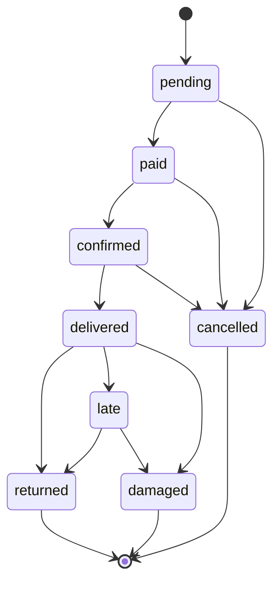
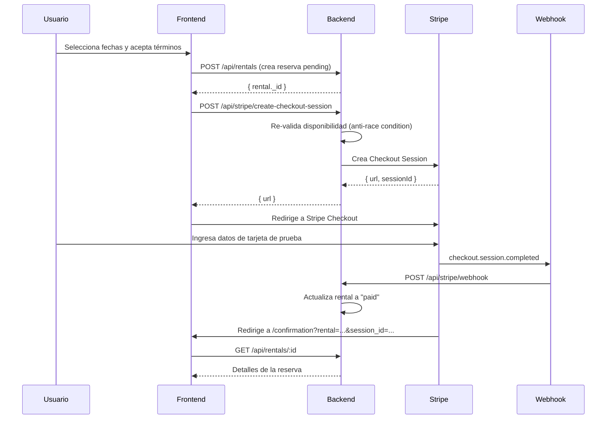

# Tembleques Camila

Plataforma web de alquiler de vestimenta típica panameña y accesorios folclóricos. Permite a clientes explorar el catálogo, reservar productos por fechas, aceptar términos de uso y pagar en línea. Incluye un panel de administración separado para gestionar inventario, reservas y usuarios.

---

## Descripción del Proyecto

Tembleques Camila digitaliza el proceso de alquiler de vestimenta típica panameña (polleras, vestuario masculino, trajes infantiles, tembleques y accesorios) que tradicionalmente se gestionaba de forma manual.

### Modelo de Negocio

El sistema funciona bajo un esquema de **alquiler por fechas**. El cliente selecciona un producto, elige un rango de fechas, acepta los términos de responsabilidad sobre el artículo y paga en línea mediante Stripe. Cada pieza puede ser alquilada múltiples veces, generando ingresos recurrentes sobre un inventario reutilizable.

### Categorías de Productos

- Polleras (montuna y de gala)
- Vestuario masculino tipico
- Vestuario infantil
- Tembleques artesanales
- Accesorios (peinetas, cadenas, joyería)
- Paquetes completos para eventos

### Catálogo y Búsqueda Avanzada

El catálogo cuenta con un sistema de búsqueda y filtrado avanzado para optimizar la conversión y la experiencia del usuario:
- **Filtrado Acumulable**: Los clientes pueden seleccionar múltiples categorías (ej. *Polleras* + *Infantil*) y ver los resultados combinados de manera fluida.
- **Selector Inteligente de Tallas**: Agrupación visual de tallas (ej. *Adultos*: S, M, L / *Infantil*: 2-4, 6-8) y selección múltiple, eliminando problemas de orden alfabético.
- **Configuración Dinámica (Admin)**: Todas las categorías y agrupaciones de tallas son gestionables desde el panel de administrador (`/admin/settings`). El admin puede añadir nuevas categorías, agrupar tallas, reordenarlas o eliminarlas sin necesidad de realizar cambios en el código (`Settings` model).
- **Filtro por Disponibilidad de Fechas**: El catálogo oculta automáticamente los productos que ya están reservados para el rango de fechas seleccionado por el cliente.
- **UX Premium**: Animaciones suaves con `framer-motion` para expandir los filtros, sin problemas de recorte (`overflow-hidden`) que estropeen el diseño neobrutalista.

---

## Arquitectura

El sistema está dividido en tres servicios independientes, todos orquestados mediante Docker Compose:

```
parcial-dsix/
  docker-compose.yml       # Orquestación de servicios
  .env                     # Configuración y secretos
  backend/
    src/
      models/              # Schemas de Mongoose (Product, Rental, User, Settings)
      routes/              # Endpoints API (Auth, Admin, Stripe, Rentals)
      services/            # Lógica de Negocio (Stripe, Rental, PaymentRules, Availability)
      middleware/          # Auth & Role guards
  frontend/
    src/
      components/          # UI Components & Layouts
      pages/               # Páginas (Landing, Catalog, Checkout, Admin Panels)
      hooks/               # Custom hooks (useAuth, etc)
      services/            # API Client (Axios)
```

### Diagrama de Servicios


### Stack Tecnológico

| Capa | Tecnología |
|---|---|
| **Frontend** | React 19, React Router 7, Vite 6 |
| **UI** | TailwindCSS v4, shadcn/ui, Lucide Icons |
| **Tema** | OKLCH Neobrutalista (variables CSS en `index.css`) |
| **Backend** | Bun runtime, Hono framework |
| **Validacion** | Zod |
| **Base de Datos** | MongoDB 7 via Mongoose |
| **Autenticación** | Clerk (email, Google, Microsoft, OTP, password recovery) |
| **Pagos** | Stripe Checkout Sessions |
| **Imágenes** | Cloudinary (unsigned upload + WebP via `f_auto,q_auto`) |
| **Contenedores** | Docker + Docker Compose |

---

## Cómo Funciona

### Flujo del Cliente

1. El usuario explora el catálogo y filtra por categoría, talla o precio.
2. Selecciona un producto y ve su disponibilidad.
3. Elige fechas de inicio y devolución.
4. Lee y acepta los términos y condiciones mediante un checkbox obligatorio — el botón de pago permanece deshabilitado hasta la aceptación.
5. Se registra la aceptación en base de datos con timestamp, IP y user agent.
6. Paga mediante Stripe Checkout. En modo demo (sin clave real de Stripe), el pago se simula automáticamente.
7. Recibe una pantalla de confirmación con los detalles de la reserva.

### Flujo del Administrador

El panel de administración vive en `/admin` y es completamente independiente del sitio cliente. Requiere una cuenta con rol `admin`.

- **Dashboard**: KPIs en tiempo real (reservas activas, ingresos del mes, próximas devoluciones, alertas de daños).
- **Inventario**: CRUD completo de productos. Crear, editar, marcar como disponible/en mantenimiento, eliminar.
- **Reservas**: Ver todas las reservas con filtros por estado. Avanzar el ciclo de vida: Pendiente → Pagado → Confirmado → Entregado → Devuelto.
- **Usuarios**: Lista de clientes con historial expandible de alquileres por cliente.

### Estados de una Reserva



### Protección contra Doble Reserva

El backend valida disponibilidad en el momento de crear la sesión de Stripe, no solo al crear la reserva. Esto previene condiciones de carrera donde dos usuarios podrían reservar el mismo producto para las mismas fechas de forma concurrente.

---

## Base de Datos

Cuatro colecciones en MongoDB:

| Colección | Propósito |
|---|---|
| `users` | Clientes y administradores. Sincronizados desde Clerk. |
| `products` | Catálogo avanzado. Incluye `variants` (stock/precio por talla) y `deposit_settings` (depósitos forzados o dinámicos). |
| `rentals` | El núcleo del negocio. Registra fechas, estados de pago/depósito, penalidades por atraso y referencias a Stripe. |
| `termsacceptances` | Registro auditable de aceptación de términos (IP, Timestamp). |
| `settings` | Configuración global dinámica de categorías y agrupaciones de tallas. |

### Arquitectura de Tallas y Variantes

Para soportar productos que varían en tamaño (ej. camisillas, polleras infantiles), la plataforma implementa una arquitectura basada en variantes:
- **Gestión por Variante:** El stock y el estado de mantenimiento se manejan individualmente por talla, no a nivel global del producto.
- **Precios Dinámicos:** Una talla específica puede tener un sobreprecio (ej. Talla XL cuesta $20 más). El catálogo calculará y mostrará automáticamente rangos de precios (ej. `$150 - $170 / día`).
- **Validación de Disponibilidad:** El motor de disponibilidad (`availability.ts`) evalúa los conflictos de calendario tomando en cuenta *únicamente* la capacidad de stock de la talla seleccionada.

---

## Lógica Operativa y Financiera

La plataforma implementa reglas automáticas para proteger el inventario y garantizar el cumplimiento de los contratos de alquiler:

### 1. Depósito de Garantía (Hold en Stripe)
Para artículos de alto valor o configuraciones específicas, el sistema realiza una **autorización bancaria (hold)** en lugar de un cobro directo:
- **Regla Global:** Por defecto, si el total de la reserva supera los **$350**, se exige un depósito del **35%** del total.
- **Regla por Producto:** El administrador puede forzar un depósito para cualquier producto (ej. joyería delicada) y definir un monto fijo en dólares ($) desde el panel de inventario.
- **Gestión:** El hold se crea automáticamente al pagar. Si el producto se marca como `returned`, el hold se libera; si se marca como `damaged`, se captura el monto total del depósito.

### 2. Gestión de Atrasos y Penalidades
El sistema calcula la mora de forma incremental basándose en la medianoche de Panamá (UTC-5):
- **Identificación:** El dashboard muestra un widget de **"Posibles Atrasos"** con productos cuya fecha de devolución ya pasó.
- **Cálculo:** La mora se calcula como: `(Total Reserva / Días Reserva) * Tasa Mora`. La tasa por defecto es **1x** (un día extra por cada día de retraso).
- **Cobro:** Al marcar una reserva como `late`, el backend intenta cobrar automáticamente la penalidad acumulada a la tarjeta guardada del cliente en Stripe.

### 3. Corte de Reservas (6:00 PM)
Para garantizar la logística de entrega, el sistema bloquea reservas para el día siguiente si se realizan después de las **18:00 horas**. A partir de esa hora, la fecha mínima de inicio permitida es el día subsiguiente (48h).

---

---

## Inicio Rápido

### Requisitos

- Docker Desktop instalado y corriendo
- Git

### 1. Clonar y configurar

```bash
git clone <repo-url>
cd parcial-dsix

# Copiar las variables de entorno
cp .env.example .env
```

### 2. Levantar el sistema

```bash
docker compose up --build
```

Este comando construye las imágenes de frontend y backend, espera a que MongoDB esté listo (health check), ejecuta el seed automático y levanta los tres servicios.

### 3. Acceder

| Servicio | URL |
|---|---|
| Sitio web (cliente) | http://localhost:5173 |
| Panel administrador | http://localhost:5173/admin |
| API REST | http://localhost:3000 |


### Comandos Útiles

```bash
# Ver logs en tiempo real
docker compose logs -f

# Ver logs de un servicio específico
docker compose logs -f backend
docker compose logs -f frontend

# Detener los contenedores
docker compose down

# Detener y borrar la base de datos (reset completo)
docker compose down -v

# Reiniciar un servicio específico
docker compose restart backend
```

### Desarrollo Colaborativo y Webhooks Locales

Para que servicios de terceros como **Clerk** o **Stripe** puedan enviar notificaciones (webhooks) a tu entorno de desarrollo (`localhost:3000`), necesitas exponer un túnel público.

Para facilitarlo, hemos incluido un script que usa `localtunnel` con un subdominio fijo:

```bash
cd backend
bun run tunnel
```

Esto generará la URL constante: `https://tembleques-camila.loca.lt`

Deberás configurar esta URL en los respectivos dashboards:
- **Clerk:** `https://tembleques-camila.loca.lt/api/auth/webhook`
- **Stripe:** `https://tembleques-camila.loca.lt/api/stripe/webhook`

#### Trabajando con otros desarrolladores:

Se recomienda usar **entornos separados** para no sobrescribir datos locales mutuamente:
1. Cada desarrollador se crea una cuenta gratuita en Clerk y levanta su propia aplicación en el dashboard de Clerk.
2. Cada desarrollador coloca *sus propias* API Keys (`VITE_CLERK_PUBLISHABLE_KEY`, `CLERK_SECRET_KEY`, etc.) en su archivo `.env` local.
3. Así, las bases de usuarios de prueba en Clerk estarán aisladas, permitiendo probar sin interrumpir el trabajo del otro. *(Si ambos usan el túnel al mismo tiempo y chocan, simplemente cambien el flag `--subdomain` en su `backend/package.json` temporalmente)*.

---

## Gestión de Usuarios (Clerk y MongoDB)

El sistema delega la autenticación, seguridad y flujos de cuenta a **Clerk**, pero mantiene una copia en **MongoDB** para poder relacionar las Reservas (`Rentals`) con un usuario específico de forma rápida en el backend.

### 1. Hacer el Nombre y Apellido Obligatorios
Dado que los formularios de Login/Registro son controlados por Clerk, estos ajustes se hacen desde tu Dashboard de Clerk (no en el código):
1. Ve a tu Dashboard de Clerk: **User & Authentication** > **Email, Phone, Web**.
2. En la sección **Personal Information**, busca **Name**.
3. Haz clic en el ícono de la tuerca (Ajustes) al lado de Name.
4. Marca la opción para pedir "First Name" y "Last Name", y asegúrate de marcar la casilla **"Required"**.
5. Guarda los cambios. El formulario de tu frontend se actualizará automáticamente.

### 2. Sincronización Automática (Webhooks)
Cuando un usuario se registra o elimina su cuenta en el componente de Clerk de tu frontend, Clerk envía un **Webhook** hacia tu ruta `/api/auth/webhook`. 
- Si es `user.created` o `user.updated`: El backend toma los datos y hace un *upsert* en la colección `users` de MongoDB usando su `clerkId`.
- Si es `user.deleted`: El backend lo borra de tu colección en MongoDB.

### 3. Asignación del Rol de Administrador
Dado que el modelo `User` en Mongoose ya no acepta contraseñas, **no existe una ruta para registrar admins desde la UI**. El rol se asigna directamente como un metadato en Clerk:

1. Entra a [dashboard.clerk.com](https://dashboard.clerk.com) → **Users**.
2. Selecciona el usuario que quieres convertir en Administrador.
3. Baja hasta la sección **Public Metadata**.
4. Haz clic en editar y escribe el siguiente JSON:
   ```json
   { "role": "admin" }
   ```
5. Guarda los cambios. La próxima vez que este usuario inicie sesión, o cuando su sesión refresque su token en unos minutos, la plataforma le habilitará el acceso a todas las rutas protegidas bajo `/admin`.

> [!TIP]
> **Sincronización a prueba de fallos (Desarrollo Local):** Si los webhooks fallan (muy común usando túneles locales si la URL cambia o se cae), hemos inyectado un sincronizador de respaldo en el endpoint `/api/auth/me`. Cada vez que el frontend inicializa la sesión (al recargar la página), el backend le pregunta a Clerk en vivo el rol actual del usuario y actualiza MongoDB automáticamente si hay alguna discrepancia.

---

## Variables de Entorno

| Variable | Descripción | Default |
|---|---|---|
| `MONGO_URI` | URI de conexión a MongoDB | `mongodb://mongodb:27017/tembleques_camila` |
| `VITE_CLERK_PUBLISHABLE_KEY` | Clave pública de Clerk (`pk_test_...`) | Requerida |
| `CLERK_SECRET_KEY` | Clave secreta de Clerk (`sk_test_...`) | Requerida |
| `CLERK_WEBHOOK_SECRET` | Firma del webhook de Clerk (`whsec_...`) | Requerida en producción |
| `STRIPE_SECRET_KEY` | Clave secreta de Stripe (modo test) | Placeholder (activa modo demo) |
| `STRIPE_WEBHOOK_SECRET` | Clave para validar webhooks de Stripe | Placeholder |
| `STRIPE_DEPOSIT_THRESHOLD_USD` | Umbral para activar depósito de garantía | `350` |
| `STRIPE_DEPOSIT_RATE` | Porcentaje del total usado para hold del depósito | `0.35` |
| `STRIPE_LATE_FEE_DAILY_RATE` | Multiplicador diario para mora (sobre tarifa diaria base) | `1` |
| `VITE_STRIPE_DEPOSIT_THRESHOLD_USD` | Umbral visual de depósito mostrado en Checkout | `350` |
| `VITE_STRIPE_DEPOSIT_RATE` | Porcentaje visual de depósito mostrado en Checkout | `0.35` |
| `VITE_API_URL` | URL de la API desde el frontend | `http://localhost:3000` |

---

## Stripe: Integración de Pagos

### Modo Demo vs. Modo Real

El sistema detecta automáticamente si Stripe está configurado:

| Estado de `STRIPE_SECRET_KEY` | Comportamiento |
|---|---|
| `sk_test_placeholder` (por defecto) | **Modo demo**: simula el pago sin contactar Stripe, redirige directamente a `/confirmation`. |
| Clave real (`sk_test_...`) | **Modo real**: redirige al hosted checkout de Stripe con tarjetas de prueba. |

No se requiere dinero real en ninguno de los dos modos si usas claves de test.

### Configurar Stripe (paso a paso)

#### Paso 1: Obtener las claves

1. Ve a [dashboard.stripe.com](https://dashboard.stripe.com) → **Developers → API Keys**.
2. Copia la **Secret key** (empieza con `sk_test_...`).
3. Pégala en `.env`:
   ```env
   STRIPE_SECRET_KEY=sk_test_TU_CLAVE_AQUI
   ```

#### Paso 2: Configurar webhooks (para que Stripe notifique al backend)

Stripe necesita enviar eventos al endpoint `POST /api/stripe/webhook` cuando un pago se completa o falla.

**Opción A — Stripe CLI (recomendada para desarrollo local)**

```bash
# 1. Instalar Stripe CLI
brew install stripe/stripe-cli/stripe

# 2. Autenticarse con tu cuenta Stripe
stripe login

# 3. En una terminal aparte, reenviar eventos a tu backend local
stripe listen --forward-to localhost:3000/api/stripe/webhook
```

La CLI imprimirá tu webhook secret:
```
> Ready! Your webhook signing secret is whsec_xxxxxxxxxxxxxxxxxxxx
```

Copia ese valor y pégalo en `.env`:
```env
STRIPE_WEBHOOK_SECRET=whsec_xxxxxxxxxxxxxxxxxxxx
```

> [!NOTE]
> Con Stripe CLI **no necesitas localtunnel** — actúa como proxy directo entre los servidores de Stripe y tu `localhost:3000`. Es la forma más rápida y confiable.

**Opción B — Localtunnel (para compartir webhook con equipo)**

```bash
# En una terminal aparte desde el directorio backend/
cd backend && bun run tunnel
# → URL pública: https://tembleques-camila.loca.lt
```

Luego en [dashboard.stripe.com](https://dashboard.stripe.com) → **Developers → Webhooks → Add endpoint**:
- URL: `https://tembleques-camila.loca.lt/api/stripe/webhook`
- Eventos a escuchar:
  - `checkout.session.completed`
  - `checkout.session.expired`
  - `payment_intent.payment_failed`
- Copia el **Signing secret** generado → `STRIPE_WEBHOOK_SECRET` en `.env`

#### Paso 3: Tarjetas de prueba (sin cobro real)

| Resultado esperado | Número de tarjeta | Fecha | CVV |
|---|---|---|---|
| ✅ Pago exitoso | `4242 4242 4242 4242` | Cualquier fecha futura | Cualquier 3 dígitos |
| ❌ Pago rechazado | `4000 0000 0000 0002` | Cualquier fecha futura | Cualquier 3 dígitos |
| 🔐 Requiere 3DS | `4000 0025 0000 3155` | Cualquier fecha futura | Cualquier 3 dígitos |

> [!TIP]
> Usa ZIP `10001` si el formulario de Stripe lo pide (cualquier valor de 5 dígitos funciona).

### Eventos de Webhook manejados

| Evento Stripe | Acción en el sistema |
|---|---|
| `checkout.session.completed` | Actualiza reserva a `status: "paid"`, `payment_status: "completed"` |
| `checkout.session.expired` | Actualiza reserva a `status: "cancelled"`, `payment_status: "failed"` |
| `payment_intent.payment_failed` | Actualiza `payment_status: "failed"` |

### Flujo técnico completo



### Futuras funcionalidades de pago (próxima rama)

Las siguientes funcionalidades de Stripe están documentadas en el PRD pero **no implementadas en esta versión**. Se abordarán en una rama dedicada:

- **Depósito de garantía**: Usar `PaymentIntent` con `capture_method: manual` para hacer un hold en la tarjeta del cliente al momento de la reserva. El monto se captura si hay daños, o se libera al devolver el artículo en buenas condiciones.
- **Penalidades por atraso**: Calcular automáticamente el costo extra cuando `rental.status = "late"` basado en los días de retraso respecto a `end_date`. Requiere un job cron o un mecanismo de revisión periódica.
- **Cobro adicional por daños**: Desde el panel admin, generar un `PaymentIntent` adicional cuando `status = "damaged"` con el monto de reparación/reposición.

### Rama de trabajo: depósito de garantía y penalidades por atraso

Esta rama concentra la documentación funcional de los dos cobros diferidos que faltan por implementar en el flujo de alquiler. El objetivo es extender el modelo actual sin romper la experiencia de reserva, manteniendo la aceptación de términos como requisito obligatorio y conservando la validación de disponibilidad antes de iniciar cualquier cobro.

#### Objetivo funcional

- **Depósito de garantía**: bloquear temporalmente un monto en la tarjeta para artículos de alto valor, con liberación automática al devolver el producto sin incidencias.
- **Penalidad por atraso**: calcular y aplicar un cobro automático cuando una reserva entra en `late` y supera la fecha comprometida de devolución.
- **Cobro por daños**: habilitar el cobro del depósito retenido, o un cargo adicional, cuando el artículo regresa en estado `damaged`.

#### Estado actual en esta rama (MVP funcional)

- Se calcula automáticamente si una reserva requiere depósito al momento de crearla (`pending_hold` vs `not_required`).
- Al completar el checkout de Stripe, el backend intenta crear un hold manual (`capture_method: manual`) usando el método de pago guardado para cobros off-session.
- Al pasar una reserva a `late`, se calculan `late_days` y `late_fee_amount`; el sistema intenta cobrar automáticamente la mora.
- Al pasar una reserva a `returned`, se libera el hold del depósito si estaba activo.
- Al pasar una reserva a `damaged`, se captura el hold existente o se intenta un cargo directo del depósito.
- En modo demo (Stripe placeholder), estos pasos se simulan y se actualizan estados para facilitar pruebas locales.

#### Reglas de negocio esperadas

- El depósito solo debe aplicarse a productos marcados como de alto valor o con una configuración equivalente en inventario.
- El monto retenido debe ser visible antes de redirigir a Stripe, dentro del resumen de pago.
- La penalidad por atraso debe calcularse a partir de la fecha real de devolución y el día/hora de corte definidos por el negocio.
- Si la reserva cambia a `damaged`, el sistema debe registrar el motivo y abrir el flujo de cobro correspondiente desde el panel de administración.
- Ninguna operación de pago debe avanzar si el usuario no aceptó los términos; la UI debe bloquear el paso y el backend debe volver a validar la condición.

#### Flujo esperado

1. El cliente elige producto, talla y rango de fechas.
2. El backend valida disponibilidad real antes de generar la sesión de Stripe.
3. Si el producto requiere depósito, el checkout debe mostrarlo como parte del total o del hold autorizado.
4. Al finalizar el alquiler, el sistema libera el depósito si no hay incidencias.
5. Si la devolución supera la fecha límite, la reserva entra en `late` y se calcula la penalidad correspondiente.
6. Si hay daños, el panel admin puede ejecutar el cobro autorizado o el cargo adicional asociado.

#### UX y manejo de errores

- Los errores de operación en pantalla deben mostrarse con `ErrorModal`, nunca con `alert()` ni mensajes sueltos en el layout.
- Las fallas de navegación o recursos inexistentes deben seguir usando `ErrorPage` con sus variantes ya definidas.
- Para esta rama, los mensajes de error deben permanecer en español y mantener el mismo tono del resto de la aplicación.
- Si falla la creación del hold, el cobro por atraso o el cargo por daños, la pantalla debe ofrecer una acción clara para volver al catálogo, al checkout o al panel, según el contexto.

#### Puntos de integración sugeridos

- **Backend**: `backend/src/services/stripe.ts`, `backend/src/services/rental.ts` y los endpoints de administración relacionados con cambios de estado.
- **Frontend**: `frontend/src/pages/Checkout.tsx`, `frontend/src/pages/Confirmation.tsx`, `frontend/src/pages/admin/Reservations.tsx` y los componentes de error reutilizables.
- **Persistencia**: extender `Rentals` para registrar depósito, penalidad aplicada, motivo del cargo y estado de cobro asociado.

---


```
backend/src/
  index.ts                  # Servidor Hono, rutas montadas, arranque
  db.ts                     # Conexión MongoDB con reintentos
  seed.ts                   # Datos iniciales (admin + 12 productos)
  models/
    User.ts                 # Schema de usuarios con roles
    Product.ts              # Schema de productos con categorías
    Rental.ts               # Schema de reservas con 8 estados
    TermsAcceptance.ts      # Registro de aceptación de términos
  routes/
    auth.ts                 # POST /register, POST /login, GET /me
    products.ts             # GET / (filtros), GET /:id, GET /:id/availability
    rentals.ts              # POST /, GET /my, GET /:id, DELETE /:id (cancelar)
    admin.ts                # Dashboard, CRUD productos, gestion reservas
    stripe.ts               # Checkout session, webhook
  middleware/
    auth.ts                 # Verificacion Clerk JWT, guard de admin, upsert automático
  services/
    availability.ts         # Validación de solapamiento de fechas
    rental.ts               # Cálculo de totales, creación, transiciones de estado
    stripe.ts               # Lógica de Stripe: createSession, handleWebhookEvent

frontend/src/
  index.css                 # Tema OKLCH neobrutalista (fuente de verdad de estilos)
  main.tsx                  # Entry point
  App.tsx                   # Router y rutas protegidas
  hooks/
    useAuth.tsx             # Contexto de autenticación JWT con localStorage
  services/
    api.ts                  # Capa de acceso a todos los endpoints del backend
  components/
    ui/                     # Componentes shadcn/ui adaptados al tema
    ImageUpload.tsx         # Subida unsigned a Cloudinary con validación y preview WebP
        AvailabilityCalendar.tsx  # Mini-calendario con fechas bloqueadas y stock
    layouts/
      ClientLayout.tsx      # Navbar + Footer para el sitio publico
      AdminLayout.tsx       # Sidebar para el panel de administración
  pages/
    Landing.tsx             # Página principal con hero, catálogo, FAQ
    Catalog.tsx             # Grid de productos con búsqueda y filtros
    ProductDetail.tsx       # Detalle de producto con galería
    Checkout.tsx            # Flujo de reserva con términos obligatorios
    Confirmation.tsx        # Pantalla de éxito post-pago
    Login.tsx               # Inicio de sesión
    Register.tsx            # Registro de cuenta
    Profile.tsx             # Perfil y historial de reservas
    admin/
      Dashboard.tsx         # KPIs y alertas
      Inventory.tsx         # CRUD de productos
      Reservations.tsx      # Gestion de reservas con transiciones
      Users.tsx             # Lista de clientes con historial
```

---

## API Endpoints

| Método | Ruta | Auth | Descripción |
|---|---|---|---|
| `GET` | `/api/auth/me` | Clerk JWT | Usuario autenticado (perfil MongoDB) |
| `POST` | `/api/auth/webhook` | Svix signature | Sincronización usuarios Clerk → MongoDB |
| `GET` | `/api/products` | No | Catálogo con filtros |
| `GET` | `/api/products/:id` | No | Detalle de producto |
| `GET` | `/api/products/:id/availability` | No | Fechas ocupadas |
| `POST` | `/api/rentals` | JWT | Crear reserva |
| `GET` | `/api/rentals/my` | JWT | Mis reservas |
| `GET` | `/api/rentals/:id` | JWT | Detalle de reserva |
| `POST` | `/api/stripe/create-checkout-session` | JWT | Iniciar pago |
| `POST` | `/api/stripe/webhook` | No | Confirmar pago |
| `GET` | `/api/admin/dashboard` | Admin | KPIs |
| `POST` | `/api/admin/products` | Admin | Crear producto |
| `PUT` | `/api/admin/products/:id` | Admin | Editar producto |
| `DELETE` | `/api/admin/products/:id` | Admin | Eliminar producto |
| `GET` | `/api/admin/rentals` | Admin | Todas las reservas |
| `PATCH` | `/api/admin/rentals/:id/status` | Admin | Cambiar estado |
| `GET` | `/api/admin/users` | Admin | Lista de clientes |
| `GET` | `/api/admin/users/:id/rentals` | Admin | Historial de cliente |

---

## Manejo de Errores

El sistema usa un patrón de errores centralizado. Todos los errores siguen el mismo flujo y formato.

### Flujo en el Backend

```
Servicio/Ruta  →  throw new AppError(mensaje, statusCode, code)
                         ↓
              Manejador global en index.ts
                         ↓
              { error: "Mensaje legible", code: "ERROR_CODE" }
```

Los errores inesperados (caídas de MongoDB, bugs no anticipados) son capturados por el manejador global y devuelven un mensaje genérico seguro — **nunca se expone el stack trace ni mensajes internos de MongoDB al cliente.**

### Códigos de Error del Backend

| Código | HTTP | Cuándo ocurre |
|---|---|---|
| `AUTH_TOKEN_REQUIRED` | 401 | No se envió el header `Authorization` |
| `AUTH_TOKEN_INVALID` | 401 | Token JWT malformado o expirado |
| `AUTH_USER_NOT_FOUND` | 401 | Token válido pero el usuario fue eliminado |
| `AUTH_INVALID_CREDENTIALS` | 401 | Email o contraseña incorrectos |
| `AUTH_EMAIL_TAKEN` | 400 | El correo ya está registrado |
| `AUTH_FORBIDDEN` | 403 | El usuario no tiene rol de administrador |
| `PRODUCT_NOT_FOUND` | 404 | El ID del producto no existe |
| `PRODUCT_NOT_AVAILABLE` | 409 | El producto no está en estado `disponible` |
| `PRODUCT_DATES_UNAVAILABLE` | 409 | Las fechas se solapan con otra reserva activa |
| `RENTAL_TERMS_NOT_ACCEPTED` | 400 | `termsAccepted` es `false` |
| `RENTAL_INVALID_DATE_RANGE` | 400 | `startDate` >= `endDate` |
| `RENTAL_DATE_IN_PAST` | 400 | `startDate` es una fecha pasada |
| `RENTAL_NOT_FOUND` | 404 | El ID de reserva no existe |
| `RENTAL_INVALID_TRANSITION` | 400 | Transición de estado no válida |
| `VALIDATION_ERROR` | 400 | Fallo en validación Zod (cualquier ruta) |
| `INTERNAL_ERROR` | 500 | Excepción no controlada en el servidor |

### Páginas de Error en el Frontend

| Variante | Cuándo se muestra |
|---|---|
| `not-found` | URL que no coincide con ninguna ruta |
| `product-not-found` | Producto no encontrado en `/product/:id` o checkout |
| `unauthorized` | Ruta protegida sin sesión activa |
| `session-expired` | Token en `localStorage` pero ya expirado |
| `forbidden` | Usuario autenticado sin rol de administrador |
| `server-error` | Error 500 inesperado del servidor |

Todas las páginas de error incluyen un **botón de volver atrás** y un **botón de acción principal** contextual (ir al inicio, catálogo, o login según el caso).

### Modal de Error

Para errores que ocurren durante operaciones en página (envío de formularios, llamadas API), se usa el componente `ErrorModal` con el hook `useErrorModal`. Nunca se usan `alert()` ni banners inline para errores post-submit.

Este modal está implementado actualmente en:
- **Login**: Errores de credenciales y fallos de red.
- **Registro**: Errores de validación y correos duplicados.
- **Checkout**: Validaciones de fechas, aceptación de términos y fallos en el procesamiento del pago/reserva.

### Mensajes Esperados por Endpoint

| Escenario | Endpoint | HTTP | Mensaje |
|---|---|---|---|
| Contraseña incorrecta | `POST /api/auth/login` | 401 | "Credenciales inválidas" |
| Email no registrado | `POST /api/auth/login` | 401 | "Credenciales inválidas" |
| Email duplicado en registro | `POST /api/auth/register` | 400 | "Ya existe una cuenta con ese correo electrónico" |
| Contraseña muy corta | `POST /api/auth/register` | 400 | "La contraseña debe tener al menos 6 caracteres" |
| Sin token | Rutas protegidas | 401 | "Token de autorización requerido" |
| Token expirado | Rutas protegidas | 401 | "Token inválido o expirado. Inicia sesión nuevamente." |
| Sin rol admin | Rutas de admin | 403 | "Acceso denegado. Se requiere rol de administrador." |
| Reservar sin aceptar términos | `POST /api/rentals` | 400 | "Debe aceptar los términos y condiciones para continuar." |
| Fechas en el pasado | `POST /api/rentals` | 400 | "La fecha de inicio no puede ser en el pasado." |
| Fechas solapadas | `POST /api/rentals` | 409 | "El producto no está disponible para las fechas seleccionadas." |
| Producto no disponible | `POST /api/rentals` | 409 | "Este producto no está disponible para alquiler en este momento." |

---

## Troubleshooting y Errores Comunes

Durante el desarrollo, pueden surgir ciertos errores conocidos. Aquí se documentan sus causas y cómo se resolvieron para mantener un registro histórico y facilitar el mantenimiento.

### 1. Error 500 en Stripe Checkout (`url_invalid`)
**Síntoma:** Al intentar pagar, el backend devuelve un error 500 y en los logs aparece `code: "url_invalid"` y `param: "cancel_url"`.
**Causa:** La URL de cancelación (`cancel_url`) enviada a Stripe contenía un objeto de Mongoose poblado en lugar de un ID de texto. Al concatenarse en un template string, se convertía en `http://.../checkout/[object Object]?cancelled=1`, lo cual es una URL inválida por contener espacios y corchetes.
**Solución:** Extraer y forzar explícitamente el `_id` (`(product as any)._id`) al armar la URL en `backend/src/services/stripe.ts`.

### 2. Error 401 (Unauthorized) al pagar o cancelar desde el Perfil
**Síntoma:** El usuario intenta cancelar una reserva pendiente o reintentar el pago tras dejar la pestaña inactiva unos minutos, y recibe un error *"Token inválido o expirado"*.
**Causa:** Los tokens JWT de Clerk tienen una caducidad muy corta por seguridad (~1 minuto). Si el frontend guarda el token en el estado de React (`useAuth`), este se vuelve obsoleto rápidamente.
**Solución:** Se implementó un interceptor en `frontend/src/services/api.ts` que ignora el token en caché y siempre solicita uno fresco antes de la petición usando `window.Clerk.session.getToken()`.

### 3. Calendario atascado al seleccionar fechas conflictivas
**Síntoma:** Si el usuario escoge una fecha de inicio (ej. Lunes) y existen reservas en días intermedios (Martes/Miércoles), los días posteriores (Jueves/Viernes) se pintan de rojo y quedan bloqueados (`disabled`), impidiendo seleccionarlos siquiera como un *nuevo* inicio.
**Causa:** El atributo HTML `disabled` cancela el evento `onClick`. 
**Solución:** Se retiró el `disabled` de los estados `conflictEnd`. Ahora, si el usuario hace clic en una fecha que generaría solapamiento, el calendario asume inteligentemente que se desea iniciar un nuevo rango y reinicia la fecha de inicio (`onStartDateChange`) a ese día. La fórmula de validación de rangos usada es `A.start <= B.end && A.end >= B.start`.

### 4. Variables del archivo `.env` ignoradas por Docker
**Síntoma:** Tras cambiar la variable `STRIPE_SECRET_KEY` de "demo" a una clave real en `.env`, el backend sigue funcionando en modo demo incluso ejecutando `docker restart backend`.
**Causa:** Docker Compose "cachea" las variables de entorno en la creación inicial del contenedor. Un reinicio simple (`restart`) solo reinicia el proceso interno con las variables cacheadas en memoria.
**Solución:** Para que Docker lea nuevamente el `.env`, es obligatorio forzar la recreación del contenedor:
```bash
docker-compose up -d --force-recreate backend
```

### 5. Errores de "content.js" o "addListener" en consola
**Síntoma:** Errores en la consola del navegador como `Uncaught TypeError: Cannot read properties of undefined (reading 'addListener')` indicando archivos como `content.js` o `ff-content.js`.
**Causa:** Estos errores provienen de extensiones de terceros instaladas en el navegador del usuario (bloqueadores de anuncios, gestores de contraseñas, extensiones de DevTools). El código fuente del proyecto no inyecta esos archivos.
**Solución:** Se pueden ignorar de forma segura, o deshabilitar las extensiones en modo incógnito/desarrollo para tener una consola más limpia.

### 6. Reserva se queda "Pendiente" tras pago exitoso con Stripe (Race Condition)
**Síntoma:** El usuario completa el pago en Stripe, es redirigido a `/confirmation`, pero la página muestra el estado como "Pendiente" en lugar de "Pagado".
**Causa:** Se produce una condición de carrera. Stripe redirige al usuario al *success_url* antes de que el *webhook* (`checkout.session.completed`) llegue al backend o sea procesado por este (especialmente crítico si se prueba en local sin hacer túnel de webhooks).
**Solución:** Se añadió un endpoint de verificación síncrona `GET /api/stripe/verify-session`. Cuando `Confirmation.tsx` detecta un `session_id` en la URL, hace una llamada a este endpoint, el cual consulta directamente la API de Stripe y fuerza la actualización de la base de datos a `Pagado` antes de renderizar la página.

### 7. Fechas incorrectas y problemas por zona horaria (UTC)
**Síntoma:** El frontend permitía seleccionar el día actual o se adelantaba de día por las noches, mientras que el backend rechazaba reservaciones válidas marcándolas erróneamente "en el pasado".
**Causa:** Funciones como `toISOString()` en JavaScript convierten las fechas a UTC. A altas horas de la noche en Panamá (UTC-5), el sistema ya consideraba que era el día siguiente. Asimismo, el backend comparaba la medianoche exacta contra la hora actual del servidor.
**Solución:** 
- En el frontend, se reemplazó `toISOString()` por una extracción puramente local.
- En el backend, se implementó un offset matemático de -5 horas para sincronizar todas las validaciones de fechas con el huso horario estricto de Panamá.
- **Regla de Negocio (Corte a las 6 PM):** Se añadió además una regla en ambos extremos: pasadas las 18:00 horas (Panamá), el sistema automáticamente exige mínimo 2 días de anticipación (pasado mañana) en lugar de 1, mostrando un aviso y bloqueando el día siguiente en el calendario.

### 8. Error 500 al listar Reservas (Virtuals vs Populate)
**Síntoma:** El panel de administración devolvía un error 500 al intentar cargar la lista de reservas o el dashboard.
**Causa:** Los "virtuals" del modelo `Product` (como `total_stock` o `price_range`) intentaban procesar el arreglo de `variants`. Al realizar búsquedas parciales con `populate("product_id", "name category")`, el campo `variants` no existía en el objeto, provocando un `TypeError` durante la serialización JSON.
**Solución:** Se blindaron los getters de los virtuals en `Product.ts` para verificar la existencia de los campos requeridos (`this.variants`, `this.rental_price`) antes de operar sobre ellos.

---

---

## Pendientes

### Funcionalidades

- [x] **Autenticación con Clerk** — Login con email, Google y Microsoft. Verificación de cuenta, recuperación de contraseña y notificaciones de seguridad gestionadas por Clerk. El rol `admin` se asigna desde el Clerk Dashboard vía `publicMetadata`.
- [x] **Recuperación de contraseña** — Gestionada por Clerk de forma nativa (email de código de reset). Sin necesidad de Resend ni servicio externo.
- [x] **Carga de imágenes reales** — Integrar un servicio de almacenamiento (Cloudinary o S3) para subir fotos de productos desde el panel admin. Hoy se usan URLs de imágenes externas.
- [x] **Calendario de disponibilidad visual** — Mostrar un calendario interactivo en el detalle del producto marcando las fechas ya ocupadas, en lugar del selector de fecha simple actual.
- [x] **Depósito de garantía** — Implementar holds en tarjeta con Stripe para artículos de alto valor, con cobro automático por daños. (Configurable global y por producto).
- [x] **Penalidades por atraso** — Cálculo y cobro automático manual cuando `status = late` supera la fecha de devolución; incluye UI en dashboard ("Posibles Atrasos") y lógica incremental diaria.
- [ ] **Automatización de Atrasos (Cron)** — Implementar un cron job diario para ejecutar el cobro de mora a medianoche.
- [ ] **Devoluciones B2C por QR** — Integrar un sistema de escaneo de códigos QR para facilitar la marcación instantánea a `returned` al recibir las prendas.
- [ ] **Notificaciones** — Emails de confirmación de reserva, recordatorios de devolución y alertas al admin de nuevas reservas.
- [x] **Filtro por fecha en catálogo** — Permitir al usuario filtrar el catálogo por fechas disponibles para ver solo los productos que puede reservar en ese rango.
- [x] **Configuración dinámica de Filtros (Categorías y Tallas)** — Panel de administrador avanzado (`/admin/settings`) que permite a los admins crear, reordenar y configurar dinámicamente las categorías disponibles y los grupos de tallas sin tocar código. El catálogo y la creación de inventario consumen esta configuración en tiempo real (`Settings` model).

### Infraestructura y Calidad

- [ ] **Testing unitario** — Cubrir los servicios críticos (`availability.ts`, `rental.ts`, calculo de totales) con pruebas usando `bun test`. Meta: 80% de cobertura en modulos de negocio.
- [ ] **Testing E2E con Playwright** — Automatizar los flujos principales: registro, login, reserva completa, bloqueo de checkout sin términos, y gestión admin.
- [x] **Variables de entorno en producción** — Configurar secrets reales para `JWT_SECRET`, `STRIPE_SECRET_KEY` y `MONGO_URI` antes de cualquier despliegue.
- [ ] **Dockerfile de producción** — Los Dockerfiles actuales corren en modo desarrollo con hot reload. Crear variantes de producción con builds optimizados.
- [ ] **HTTPS** — Configurar certificados SSL (Let's Encrypt via Traefik o Nginx) para el despliegue en servidor.
- [ ] **Documentación de API** — Generar documentación interactiva de los endpoints (OpenAPI / Swagger).

---

## Licencia

Proyecto académico. Uso educativo.
