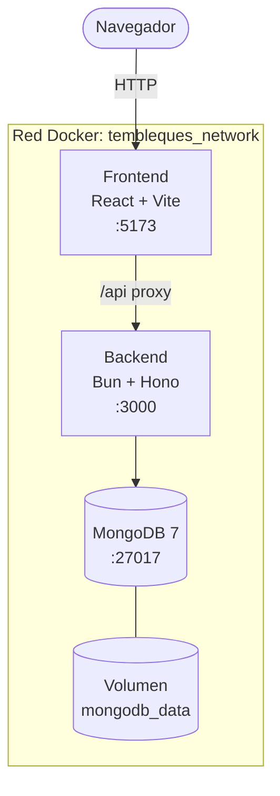
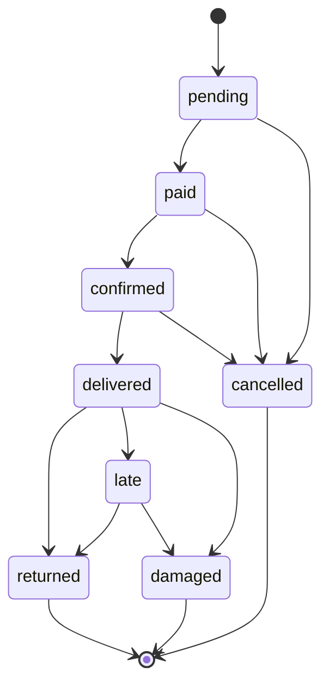

# Tembleques Camila

Plataforma web de alquiler de vestimenta típica panameña y accesorios folclóricos. Permite a clientes explorar el catálogo, reservar productos por fechas, aceptar términos de uso y pagar en línea. Incluye un panel de administración separado para gestionar inventario, reservas y usuarios.

---

## Descripción del Proyecto

Tembleques Camila digitaliza el proceso de alquiler de vestimenta típica panameña (polleras, vestuario masculino, trajes infantiles, tembleques y accesorios) que tradicionalmente se gestionaba de forma manual.

### Modelo de Negocio

El sistema funciona bajo un esquema de **alquiler por fechas**. El cliente selecciona un producto, elige un rango de fechas, acepta los términos de responsabilidad sobre el artículo y paga en línea mediante Stripe. Cada pieza puede ser alquilada múltiples veces, generando ingresos recurrentes sobre un inventario reutilizable.

### Categorías de Productos

- Polleras (montuna y de gala)
- Vestuario masculino tipico
- Vestuario infantil
- Tembleques artesanales
- Accesorios (peinetas, cadenas, joyería)
- Paquetes completos para eventos

---

## Arquitectura

El sistema está dividido en tres servicios independientes, todos orquestados mediante Docker Compose:

```
parcial-dsix/
  docker-compose.yml       # Orquestación de los 3 servicios
  .env                     # Variables de entorno
  backend/                 # API REST (Bun + Hono + MongoDB)
  frontend/                # Interfaz web (React + Vite + shadcn/ui)
```

### Diagrama de Servicios



### Stack Tecnológico

| Capa | Tecnología |
|---|---|
| **Frontend** | React 19, React Router 7, Vite 6 |
| **UI** | TailwindCSS v4, shadcn/ui, Lucide Icons |
| **Tema** | OKLCH Neobrutalista (variables CSS en `index.css`) |
| **Backend** | Bun runtime, Hono framework |
| **Validacion** | Zod |
| **Base de Datos** | MongoDB 7 via Mongoose |
| **Autenticación** | Clerk (email, Google, Microsoft, OTP, password recovery) |
| **Pagos** | Stripe Checkout Sessions |
| **Contenedores** | Docker + Docker Compose |

---

## Cómo Funciona

### Flujo del Cliente

1. El usuario explora el catálogo y filtra por categoría, talla o precio.
2. Selecciona un producto y ve su disponibilidad.
3. Elige fechas de inicio y devolución.
4. Lee y acepta los términos y condiciones mediante un checkbox obligatorio — el botón de pago permanece deshabilitado hasta la aceptación.
5. Se registra la aceptación en base de datos con timestamp, IP y user agent.
6. Paga mediante Stripe Checkout. En modo demo (sin clave real de Stripe), el pago se simula automáticamente.
7. Recibe una pantalla de confirmación con los detalles de la reserva.

### Flujo del Administrador

El panel de administración vive en `/admin` y es completamente independiente del sitio cliente. Requiere una cuenta con rol `admin`.

- **Dashboard**: KPIs en tiempo real (reservas activas, ingresos del mes, próximas devoluciones, alertas de daños).
- **Inventario**: CRUD completo de productos. Crear, editar, marcar como disponible/en mantenimiento, eliminar.
- **Reservas**: Ver todas las reservas con filtros por estado. Avanzar el ciclo de vida: Pendiente → Pagado → Confirmado → Entregado → Devuelto.
- **Usuarios**: Lista de clientes con historial expandible de alquileres por cliente.

### Estados de una Reserva



### Protección contra Doble Reserva

El backend valida disponibilidad en el momento de crear la sesión de Stripe, no solo al crear la reserva. Esto previene condiciones de carrera donde dos usuarios podrían reservar el mismo producto para las mismas fechas de forma concurrente.

---

## Base de Datos

Cuatro colecciones en MongoDB:

| Colección | Propósito |
|---|---|
| `users` | Clientes y administradores. Indice unico en `email`. |
| `products` | Catálogo con stock, categoría, precio y imágenes. Indices en `category`, `stock`, `condition_status`. |
| `rentals` | Reservas con estado, fechas y referencia al pago de Stripe. Indice compuesto en `product_id`, `start_date`, `end_date`. |
| `termsacceptances` | Registro de aceptación de términos por reserva (timestamp, IP, user agent). |

---

## Inicio Rápido

### Requisitos

- Docker Desktop instalado y corriendo
- Git

### 1. Clonar y configurar

```bash
git clone <repo-url>
cd parcial-dsix

# Copiar las variables de entorno
cp .env.example .env
```

### 2. Levantar el sistema

```bash
docker compose up --build
```

Este comando construye las imágenes de frontend y backend, espera a que MongoDB esté listo (health check), ejecuta el seed automático y levanta los tres servicios.

### 3. Acceder

| Servicio | URL |
|---|---|
| Sitio web (cliente) | http://localhost:5173 |
| Panel administrador | http://localhost:5173/admin |
| API REST | http://localhost:3000 |


### Comandos Útiles

```bash
# Ver logs en tiempo real
docker compose logs -f

# Ver logs de un servicio específico
docker compose logs -f backend
docker compose logs -f frontend

# Detener los contenedores
docker compose down

# Detener y borrar la base de datos (reset completo)
docker compose down -v

# Reiniciar un servicio específico
docker compose restart backend
```

### Desarrollo Colaborativo y Webhooks Locales

Para que servicios de terceros como **Clerk** o **Stripe** puedan enviar notificaciones (webhooks) a tu entorno de desarrollo (`localhost:3000`), necesitas exponer un túnel público.

Para facilitarlo, hemos incluido un script que usa `localtunnel` con un subdominio fijo:

```bash
cd backend
bun run tunnel
```

Esto generará la URL constante: `https://tembleques-camila.loca.lt`

Deberás configurar esta URL en los respectivos dashboards:
- **Clerk:** `https://tembleques-camila.loca.lt/api/auth/webhook`
- **Stripe:** `https://tembleques-camila.loca.lt/api/stripe/webhook`

#### Trabajando con otros desarrolladores:

Se recomienda usar **entornos separados** para no sobrescribir datos locales mutuamente:
1. Cada desarrollador se crea una cuenta gratuita en Clerk y levanta su propia aplicación en el dashboard de Clerk.
2. Cada desarrollador coloca *sus propias* API Keys (`VITE_CLERK_PUBLISHABLE_KEY`, `CLERK_SECRET_KEY`, etc.) en su archivo `.env` local.
3. Así, las bases de usuarios de prueba en Clerk estarán aisladas, permitiendo probar sin interrumpir el trabajo del otro. *(Si ambos usan el túnel al mismo tiempo y chocan, simplemente cambien el flag `--subdomain` en su `backend/package.json` temporalmente)*.

---

## Gestión de Usuarios (Clerk y MongoDB)

El sistema delega la autenticación, seguridad y flujos de cuenta a **Clerk**, pero mantiene una copia en **MongoDB** para poder relacionar las Reservas (`Rentals`) con un usuario específico de forma rápida en el backend.

### 1. Hacer el Nombre y Apellido Obligatorios
Dado que los formularios de Login/Registro son controlados por Clerk, estos ajustes se hacen desde tu Dashboard de Clerk (no en el código):
1. Ve a tu Dashboard de Clerk: **User & Authentication** > **Email, Phone, Web**.
2. En la sección **Personal Information**, busca **Name**.
3. Haz clic en el ícono de la tuerca (Ajustes) al lado de Name.
4. Marca la opción para pedir "First Name" y "Last Name", y asegúrate de marcar la casilla **"Required"**.
5. Guarda los cambios. El formulario de tu frontend se actualizará automáticamente.

### 2. Sincronización Automática (Webhooks)
Cuando un usuario se registra o elimina su cuenta en el componente de Clerk de tu frontend, Clerk envía un **Webhook** hacia tu ruta `/api/auth/webhook`. 
- Si es `user.created` o `user.updated`: El backend toma los datos y hace un *upsert* en la colección `users` de MongoDB usando su `clerkId`.
- Si es `user.deleted`: El backend lo borra de tu colección en MongoDB.

### 3. Asignación del Rol de Administrador
Dado que el modelo `User` en Mongoose ya no acepta contraseñas, **no existe una ruta para registrar admins desde la UI**. El rol se asigna directamente como un metadato en Clerk:

1. Entra a [dashboard.clerk.com](https://dashboard.clerk.com) → **Users**.
2. Selecciona el usuario que quieres convertir en Administrador.
3. Baja hasta la sección **Public Metadata**.
4. Haz clic en editar y escribe el siguiente JSON:
   ```json
   { "role": "admin" }
   ```
5. Guarda los cambios. La próxima vez que este usuario inicie sesión, o cuando su sesión refresque su token en unos minutos, la plataforma le habilitará el acceso a todas las rutas protegidas bajo `/admin`.

> [!TIP]
> **Sincronización a prueba de fallos (Desarrollo Local):** Si los webhooks fallan (muy común usando túneles locales si la URL cambia o se cae), hemos inyectado un sincronizador de respaldo en el endpoint `/api/auth/me`. Cada vez que el frontend inicializa la sesión (al recargar la página), el backend le pregunta a Clerk en vivo el rol actual del usuario y actualiza MongoDB automáticamente si hay alguna discrepancia.

---

## Variables de Entorno

| Variable | Descripción | Default |
|---|---|---|
| `MONGO_URI` | URI de conexión a MongoDB | `mongodb://mongodb:27017/tembleques_camila` |
| `VITE_CLERK_PUBLISHABLE_KEY` | Clave pública de Clerk (`pk_test_...`) | Requerida |
| `CLERK_SECRET_KEY` | Clave secreta de Clerk (`sk_test_...`) | Requerida |
| `CLERK_WEBHOOK_SECRET` | Firma del webhook de Clerk (`whsec_...`) | Requerida en producción |
| `STRIPE_SECRET_KEY` | Clave secreta de Stripe (modo test) | Placeholder (activa modo demo) |
| `STRIPE_WEBHOOK_SECRET` | Clave para validar webhooks de Stripe | Placeholder |
| `VITE_API_URL` | URL de la API desde el frontend | `http://localhost:3000` |

---

## Estructura del Código

```
backend/src/
  index.ts                  # Servidor Hono, rutas montadas, arranque
  db.ts                     # Conexión MongoDB con reintentos
  seed.ts                   # Datos iniciales (admin + 12 productos)
  models/
    User.ts                 # Schema de usuarios con roles
    Product.ts              # Schema de productos con categorías
    Rental.ts               # Schema de reservas con 8 estados
    TermsAcceptance.ts      # Registro de aceptación de términos
  routes/
    auth.ts                 # POST /register, POST /login, GET /me
    products.ts             # GET / (filtros), GET /:id, GET /:id/availability
    rentals.ts              # POST /, GET /my, GET /:id
    admin.ts                # Dashboard, CRUD productos, gestion reservas
    stripe.ts               # Checkout session, webhook
  middleware/
    auth.ts                 # Verificacion Clerk JWT, guard de admin, upsert automático
  services/
    availability.ts         # Validación de solapamiento de fechas
    rental.ts               # Cálculo de totales, creación, transiciones de estado

frontend/src/
  index.css                 # Tema OKLCH neobrutalista (fuente de verdad de estilos)
  main.tsx                  # Entry point
  App.tsx                   # Router y rutas protegidas
  hooks/
    useAuth.tsx             # Contexto de autenticación JWT con localStorage
  services/
    api.ts                  # Capa de acceso a todos los endpoints del backend
  components/
    ui/                     # Componentes shadcn/ui adaptados al tema
    layouts/
      ClientLayout.tsx      # Navbar + Footer para el sitio publico
      AdminLayout.tsx       # Sidebar para el panel de administración
  pages/
    Landing.tsx             # Página principal con hero, catálogo, FAQ
    Catalog.tsx             # Grid de productos con búsqueda y filtros
    ProductDetail.tsx       # Detalle de producto con galería
    Checkout.tsx            # Flujo de reserva con términos obligatorios
    Confirmation.tsx        # Pantalla de éxito post-pago
    Login.tsx               # Inicio de sesión
    Register.tsx            # Registro de cuenta
    Profile.tsx             # Perfil y historial de reservas
    admin/
      Dashboard.tsx         # KPIs y alertas
      Inventory.tsx         # CRUD de productos
      Reservations.tsx      # Gestion de reservas con transiciones
      Users.tsx             # Lista de clientes con historial
```

---

## API Endpoints

| Método | Ruta | Auth | Descripción |
|---|---|---|---|
| `GET` | `/api/auth/me` | Clerk JWT | Usuario autenticado (perfil MongoDB) |
| `POST` | `/api/auth/webhook` | Svix signature | Sincronización usuarios Clerk → MongoDB |
| `GET` | `/api/products` | No | Catálogo con filtros |
| `GET` | `/api/products/:id` | No | Detalle de producto |
| `GET` | `/api/products/:id/availability` | No | Fechas ocupadas |
| `POST` | `/api/rentals` | JWT | Crear reserva |
| `GET` | `/api/rentals/my` | JWT | Mis reservas |
| `GET` | `/api/rentals/:id` | JWT | Detalle de reserva |
| `POST` | `/api/stripe/create-checkout-session` | JWT | Iniciar pago |
| `POST` | `/api/stripe/webhook` | No | Confirmar pago |
| `GET` | `/api/admin/dashboard` | Admin | KPIs |
| `POST` | `/api/admin/products` | Admin | Crear producto |
| `PUT` | `/api/admin/products/:id` | Admin | Editar producto |
| `DELETE` | `/api/admin/products/:id` | Admin | Eliminar producto |
| `GET` | `/api/admin/rentals` | Admin | Todas las reservas |
| `PATCH` | `/api/admin/rentals/:id/status` | Admin | Cambiar estado |
| `GET` | `/api/admin/users` | Admin | Lista de clientes |
| `GET` | `/api/admin/users/:id/rentals` | Admin | Historial de cliente |

---

## Manejo de Errores

El sistema usa un patrón de errores centralizado. Todos los errores siguen el mismo flujo y formato.

### Flujo en el Backend

```
Servicio/Ruta  →  throw new AppError(mensaje, statusCode, code)
                         ↓
              Manejador global en index.ts
                         ↓
              { error: "Mensaje legible", code: "ERROR_CODE" }
```

Los errores inesperados (caídas de MongoDB, bugs no anticipados) son capturados por el manejador global y devuelven un mensaje genérico seguro — **nunca se expone el stack trace ni mensajes internos de MongoDB al cliente.**

### Códigos de Error del Backend

| Código | HTTP | Cuándo ocurre |
|---|---|---|
| `AUTH_TOKEN_REQUIRED` | 401 | No se envió el header `Authorization` |
| `AUTH_TOKEN_INVALID` | 401 | Token JWT malformado o expirado |
| `AUTH_USER_NOT_FOUND` | 401 | Token válido pero el usuario fue eliminado |
| `AUTH_INVALID_CREDENTIALS` | 401 | Email o contraseña incorrectos |
| `AUTH_EMAIL_TAKEN` | 400 | El correo ya está registrado |
| `AUTH_FORBIDDEN` | 403 | El usuario no tiene rol de administrador |
| `PRODUCT_NOT_FOUND` | 404 | El ID del producto no existe |
| `PRODUCT_NOT_AVAILABLE` | 409 | El producto no está en estado `disponible` |
| `PRODUCT_DATES_UNAVAILABLE` | 409 | Las fechas se solapan con otra reserva activa |
| `RENTAL_TERMS_NOT_ACCEPTED` | 400 | `termsAccepted` es `false` |
| `RENTAL_INVALID_DATE_RANGE` | 400 | `startDate` >= `endDate` |
| `RENTAL_DATE_IN_PAST` | 400 | `startDate` es una fecha pasada |
| `RENTAL_NOT_FOUND` | 404 | El ID de reserva no existe |
| `RENTAL_INVALID_TRANSITION` | 400 | Transición de estado no válida |
| `VALIDATION_ERROR` | 400 | Fallo en validación Zod (cualquier ruta) |
| `INTERNAL_ERROR` | 500 | Excepción no controlada en el servidor |

### Páginas de Error en el Frontend

| Variante | Cuándo se muestra |
|---|---|
| `not-found` | URL que no coincide con ninguna ruta |
| `product-not-found` | Producto no encontrado en `/product/:id` o checkout |
| `unauthorized` | Ruta protegida sin sesión activa |
| `session-expired` | Token en `localStorage` pero ya expirado |
| `forbidden` | Usuario autenticado sin rol de administrador |
| `server-error` | Error 500 inesperado del servidor |

Todas las páginas de error incluyen un **botón de volver atrás** y un **botón de acción principal** contextual (ir al inicio, catálogo, o login según el caso).

### Modal de Error

Para errores que ocurren durante operaciones en página (envío de formularios, llamadas API), se usa el componente `ErrorModal` con el hook `useErrorModal`. Nunca se usan `alert()` ni banners inline para errores post-submit.

Este modal está implementado actualmente en:
- **Login**: Errores de credenciales y fallos de red.
- **Registro**: Errores de validación y correos duplicados.
- **Checkout**: Validaciones de fechas, aceptación de términos y fallos en el procesamiento del pago/reserva.

### Mensajes Esperados por Endpoint

| Escenario | Endpoint | HTTP | Mensaje |
|---|---|---|---|
| Contraseña incorrecta | `POST /api/auth/login` | 401 | "Credenciales inválidas" |
| Email no registrado | `POST /api/auth/login` | 401 | "Credenciales inválidas" |
| Email duplicado en registro | `POST /api/auth/register` | 400 | "Ya existe una cuenta con ese correo electrónico" |
| Contraseña muy corta | `POST /api/auth/register` | 400 | "La contraseña debe tener al menos 6 caracteres" |
| Sin token | Rutas protegidas | 401 | "Token de autorización requerido" |
| Token expirado | Rutas protegidas | 401 | "Token inválido o expirado. Inicia sesión nuevamente." |
| Sin rol admin | Rutas de admin | 403 | "Acceso denegado. Se requiere rol de administrador." |
| Reservar sin aceptar términos | `POST /api/rentals` | 400 | "Debe aceptar los términos y condiciones para continuar." |
| Fechas en el pasado | `POST /api/rentals` | 400 | "La fecha de inicio no puede ser en el pasado." |
| Fechas solapadas | `POST /api/rentals` | 409 | "El producto no está disponible para las fechas seleccionadas." |
| Producto no disponible | `POST /api/rentals` | 409 | "Este producto no está disponible para alquiler en este momento." |

---

## Pendientes

### Funcionalidades

- [x] **Autenticación con Clerk** — Login con email, Google y Microsoft. Verificación de cuenta, recuperación de contraseña y notificaciones de seguridad gestionadas por Clerk. El rol `admin` se asigna desde el Clerk Dashboard vía `publicMetadata`.
- [x] **Recuperación de contraseña** — Gestionada por Clerk de forma nativa (email de código de reset). Sin necesidad de Resend ni servicio externo.
- [ ] **Carga de imágenes reales** — Integrar un servicio de almacenamiento (Cloudinary o S3) para subir fotos de productos desde el panel admin. Hoy se usan URLs de imágenes externas.
- [ ] **Calendario de disponibilidad visual** — Mostrar un calendario interactivo en el detalle del producto marcando las fechas ya ocupadas, en lugar del selector de fecha simple actual.
- [ ] **Depósito de garantía** — Implementar holds en tarjeta con Stripe para artículos de alto valor, con cobro automático por daños.
- [ ] **Penalidades por atraso** — Calculo y cobro automático cuando `status = late` supera la fecha de devolución.
- [ ] **Notificaciones** — Emails de confirmación de reserva, recordatorios de devolución y alertas al admin de nuevas reservas.
- [ ] **Filtro por fecha en catálogo** — Permitir al usuario filtrar el catálogo por fechas disponibles para ver solo los productos que puede reservar en ese rango.

### Infraestructura y Calidad

- [ ] **Testing unitario** — Cubrir los servicios críticos (`availability.ts`, `rental.ts`, calculo de totales) con pruebas usando `bun test`. Meta: 80% de cobertura en modulos de negocio.
- [ ] **Testing E2E con Playwright** — Automatizar los flujos principales: registro, login, reserva completa, bloqueo de checkout sin términos, y gestión admin.
- [ ] **Variables de entorno en producción** — Configurar secrets reales para `JWT_SECRET`, `STRIPE_SECRET_KEY` y `MONGO_URI` antes de cualquier despliegue.
- [ ] **Dockerfile de producción** — Los Dockerfiles actuales corren en modo desarrollo con hot reload. Crear variantes de producción con builds optimizados.
- [ ] **HTTPS** — Configurar certificados SSL (Let's Encrypt via Traefik o Nginx) para el despliegue en servidor.
- [ ] **Documentación de API** — Generar documentación interactiva de los endpoints (OpenAPI / Swagger).

---

## Licencia

Proyecto académico. Uso educativo.
