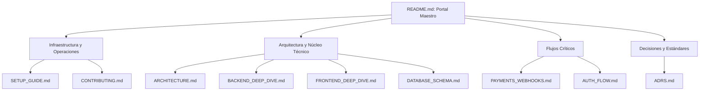

<h1 align="center">Tembleques Camila</h1>

<p align="center">
  Plataforma e-commerce premium de alta disponibilidad para la gestión y alquiler de vestimenta folclórica panameña.
</p>

<p align="center">
  
  
  
  
  
  
</p>

---

## Índice General de Documentación

Navegue rápidamente a través de los diferentes módulos del sistema:

1.  **[Infraestructura y Operaciones](#infraestructura-y-operaciones)**
2.  **[Arquitectura y Núcleo Técnico](#arquitectura-y-núcleo-técnico)**
3.  **[Flujos Críticos de Negocio](#flujos-críticos-de-negocio)**
4.  **[Estándares y Decisiones](#estándares-y-decisiones)**
5.  **[Inicio Rápido (Quick Start)](#quick-start)**

---

## Ecosistema Documental

Este mapa ilustra la jerarquía y relación entre los diferentes módulos que componen el mapa de conocimiento del proyecto.



---

## Infraestructura y Operaciones

### [SETUP_GUIDE.md](docs/SETUP_GUIDE.md)
Este documento es el punto de partida obligatorio para cualquier desarrollador que se integre al proyecto. Detalla de forma exhaustiva el proceso de "Onboarding", desde la instalación del runtime Bun hasta la orquestación de contenedores con Docker Compose. Incluye guías específicas sobre la configuración de túneles de red para webhooks y la inicialización de la Stripe CLI para entornos de desarrollo locales.

**Brief**: Guía paso a paso para levantar el entorno de desarrollo y servicios de terceros.

### [CONTRIBUTING.md](docs/CONTRIBUTING.md)
Define el marco de trabajo colaborativo y la gobernanza del repositorio. Establece estándares estrictos sobre el flujo de Git, convenciones de nomenclatura para ramas y una política de "Cero Emojis" en los mensajes de commit. Además, detalla los criterios de aceptación para las revisiones de código y las directrices de testing unitario y de integración.

**Brief**: Manual de estándares, calidad de código y protocolos de colaboración.

---

## Arquitectura y Núcleo Técnico

### [ARCHITECTURE.md](docs/ARCHITECTURE.md)
Presenta la visión técnica global de Tembleques Camila. Explica la arquitectura de "Identidad Delegada" y cómo se desacoplan las capas de presentación, lógica de negocio y persistencia. Este documento sirve como mapa estructural para comprender cómo el stack tecnológico (React 19, Bun, Hono) interactúa para ofrecer una plataforma de alta disponibilidad.

**Brief**: Esquema conceptual y estructural de alto nivel de toda la plataforma.

### [BACKEND_DEEP_DIVE.md](docs/BACKEND_DEEP_DIVE.md)
Una inmersión profunda en las entrañas del servidor. Documenta la implementación técnica de la validación de payloads mediante Zod, la arquitectura de la clase `AppError` para el manejo global de excepciones y, lo más importante, el algoritmo matemático que rige el motor de disponibilidad y la regla logística del corte de reservas a las 18:00 (Panamá).

**Brief**: Análisis exhaustivo de lógica de servidor, algoritmos y manejo de errores.

### [FRONTEND_DEEP_DIVE.md](docs/FRONTEND_DEEP_DIVE.md)
Detalla la implementación del cliente de React. Se centra en el paradigma de "URL como Fuente de Verdad" (Source of Truth), explicando cómo se sincronizan los filtros complejos y la paginación con la barra de direcciones. Incluye detalles sobre el selector inteligente de tallas y el uso de patrones avanzados de React Router v7 para la carga de datos.

**Brief**: Documentación técnica sobre gestión de estado en URL y componentes inteligentes.

### [DATABASE_SCHEMA.md](docs/DATABASE_SCHEMA.md)
Manual completo de la capa de persistencia en MongoDB. Incluye el diccionario de colecciones, la arquitectura de documentos anidados para variantes de productos y las estrategias de integridad referencial gestionadas por Mongoose. Explica cómo el esquema NoSQL permite la flexibilidad necesaria para un catálogo folclórico dinámico.

**Brief**: Definición detallada de modelos de datos, índices y relaciones NoSQL.

---

## Flujos Críticos de Negocio

### [PAYMENTS_WEBHOOKS.md](docs/PAYMENTS_WEBHOOKS.md)
Documenta el flujo más sensible del sistema: el procesamiento financiero. Detalla la máquina de estados de las reservas, la lógica de "Abono de Reserva" y la integración segura con Stripe y Svix. Explica la gestión de la idempotencia para asegurar que ningún pago se procese por duplicado y cómo funcionan los cargos automáticos por mora o daños.

**Brief**: Guía de integración financiera, webhooks de seguridad y estados de reserva.

### [AUTH_FLOW.md](docs/AUTH_FLOW.md)
Describe el ecosistema de seguridad e identidad. Detalla cómo Clerk gestiona las sesiones de usuario y cómo el backend de Hono valida los JWTs. Incluye el flujo de sincronización activa que mantiene los roles de administrador y perfiles de usuario actualizados en MongoDB mediante eventos asíncronos y fallbacks de seguridad.

**Brief**: Arquitectura de identidad delegada, validación de JWT y sincronización de perfiles.

---

## Estándares y Decisiones

### [ADRS.md](docs/ADRS.md)
El registro histórico de las decisiones de diseño arquitectónico. Cada entrada responde al "por qué" de una elección tecnológica, evaluando alternativas descartadas y analizando los riesgos y beneficios a largo plazo. Es el documento fundamental para comprender la evolución técnica del proyecto hacia finales de 2026.

**Brief**: Registro formal de decisiones técnicas, trade-offs y justificaciones de arquitectura.

---

## Quick Start

### 1. Prerrequisitos
Antes de comenzar, asegúrese de tener instaladas las siguientes herramientas:
- **Bun**: Runtime principal y gestor de dependencias.
- **Docker & Docker Compose**: Para la orquestación de servicios y base de datos.
- **Git**: Para el control de versiones.

### 2. Inicio y Onboarding
Para comenzar a colaborar en el proyecto, siga estos comandos iniciales:

```bash
# Clonar el repositorio
git clone https://github.com/tu-usuario/parcial-dsix.git
cd parcial-dsix

# Instalación de dependencias globales
bun install
```

### 3. Ejecución del Entorno
Puede levantar el ecosistema completo o ejecutar los servicios de forma independiente:

```bash
# Opción A: Ecosistema completo (Recomendado)
# Levanta Frontend, Backend y MongoDB automáticamente
docker-compose up --build

# Opción B: Ejecución local de desarrollo
# Nota: Requiere una instancia de MongoDB activa (local o Atlas)
# Puede levantar solo la DB con: docker-compose up mongodb -d
cd backend && bun run dev
cd frontend && bun run dev
```

> [!IMPORTANT]
> **Configuración Crítica**: Antes de ejecutar el sistema, es obligatorio configurar las variables de entorno en el archivo `.env`. Para un manual detallado sobre este paso y la configuración de Stripe/Clerk, consulte la **[Guía de Configuración (SETUP_GUIDE.md)](docs/SETUP_GUIDE.md)**.

---

Desarrollado con enfoque en la excelencia técnica y el respeto por las tradiciones folclóricas panameñas.
