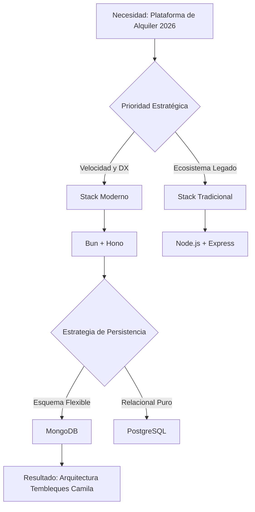
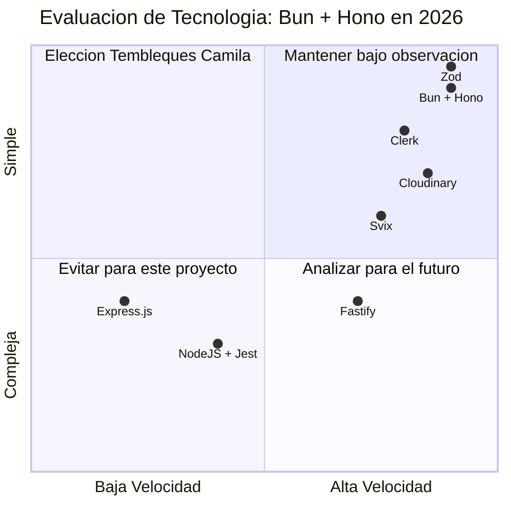

# Registro de Decisiones Arquitectónicas (ADR): Tembleques Camila

Este documento constituye el registro formal de las decisiones de diseño de software de nivel principal para la plataforma Tembleques Camila. Cada registro detalla el razonamiento técnico, las alternativas descartadas y el impacto directo en la base de código, asegurando la trazabilidad de la arquitectura hacia finales de 2026.

---

## Árbol de Decisión Tecnológica y Evaluación de Riesgos

---

## ADR 001: Adopción de Bun + Hono como Runtime y Framework de Aplicación

**Estado:** Aceptado (Abril 2026)

### Contexto Técnico Profundo
En el ecosistema de 2026, la latencia de red y el tiempo de arranque (Cold Start) de las funciones serverless o microcontenedores son factores determinantes en la experiencia del usuario. El proyecto Tembleques Camila requiere un motor capaz de procesar validaciones de disponibilidad complejas sobre calendarios de stock sin degradar la respuesta del cliente. Node.js, aunque estable, padece de una fragmentación de herramientas (ESLint, Prettier, Jest, Nodemon, dotenv) que aumenta la deuda técnica de configuración y reduce el rendimiento bruto frente a las nuevas arquitecturas de runtime.

### Alternativas Evaluadas

#### 1. Node.js + Fastify
- **Pros**: Fastify es extremadamente rápido y tiene un ecosistema de plugins maduro.
- **Contras**: La gestión de tipos en Fastify, aunque buena, no es tan nativa y fluida como en Hono. El runtime sigue siendo Node.js, con sus limitaciones inherentes en la velocidad de instalación de dependencias y arranque.

#### 2. Deno + Oak
- **Pros**: Seguridad nativa y soporte de TypeScript de primera clase.
- **Contras**: El ecosistema de librerías de Deno sigue teniendo fricciones con algunos paquetes de Node.js que son críticos para integraciones financieras como Stripe.

#### 3. Node.js + Express (El estándar legacy)
- **Pros**: Ubicuidad total y facilidad de contratación.
- **Contras**: Rendimiento significativamente inferior (hasta 10 veces más lento que Hono en benchmarks de routing). Falta de soporte nativo para `async/await` en middlewares de versiones antiguas y una gestión de tipos manual y propensa a errores.

### Decisión
Adoptar **Bun** como runtime universal (JS engine, package manager, test runner) y **Hono** como framework de servidor por su compatibilidad con Web Standards y su enfoque en el tipado estricto.

### Impacto en Código (Code-Level Impact)
- **Eliminación de Boilerplate**: Los desarrolladores ya no necesitan importar `dotenv` ni configurar `ts-node`. El comando `bun run dev` maneja la ejecución nativa de TypeScript con hot-reload instantáneo.
- **Routing Tipo-Seguro**: Hono permite definir el esquema de entrada/salida directamente en la ruta. Un cambio en la estructura de un controlador se propaga inmediatamente a los middlewares de validación Zod, reduciendo errores de "runtime" a errores de "compilación".
- **Tests Integrados**: Se utiliza `bun test`, lo que reduce el tiempo de ejecución de la suite de pruebas de minutos a segundos, fomentando la metodología TDD (Test Driven Development).

### Trade-offs y Consecuencias
- **Ecosistema Joven**: Bun, aunque estable en 2026, puede presentar comportamientos inesperados en edge cases de APIs de Node.js muy antiguas.
- **Acoplamiento**: El uso de APIs nativas de Bun (como `Bun.password` o `Bun.serve`) dificulta una migración futura a Node.js sin un refactor considerable.
- **Velocidad de DX**: La ganancia en productividad es del ~30% gracias a la eliminación de herramientas de compilación externas.

---

## ADR 002: Persistencia Documental (MongoDB) vs Relacional (SQL)

**Estado:** Aceptado

### Contexto Técnico Profundo
El catálogo de vestimenta folclórica panameña no es uniforme. Un "Paquete de Alquiler de Pollera" puede incluir una jerarquía compleja de accesorios (peinetas, joyería, calzado) con stocks y estados de mantenimiento independientes. Modelar esto en una base de datos relacional tradicional requeriría un esquema altamente normalizado con múltiples tablas y JOINs costosos para cada visualización de producto.

### Alternativas Evaluadas

#### 1. PostgreSQL + JSONB
- **Pros**: Combina la robustez de ACID con la flexibilidad de campos JSON.
- **Contras**: Realizar agregaciones complejas sobre el stock dentro de campos JSONB es técnicamente más complejo y menos performante que el motor nativo de agregaciones de MongoDB.

#### 2. PostgreSQL Puro (Normalización Total)
- **Pros**: Integridad referencial absoluta a nivel de motor.
- **Contras**: Inflexibilidad ante cambios en la estructura de los productos. Añadir una nueva categoría de accesorios requeriría migraciones de base de datos que podrían bloquear tablas críticas de inventario.

### Decisión
Utilizar **MongoDB 7.0** con **Mongoose** como ODM, priorizando la flexibilidad del modelo de documentos para la arquitectura de variantes y tallas.

### Impacto en Código (Code-Level Impact)
- **Esquemas Dinámicos**: Los desarrolladores pueden utilizar `Mixed` types o subdocumentos para variantes de productos, permitiendo que un producto de "Joyería" tenga campos de "quilates" que un producto de "Vestuario" no posee, sin ensuciar el modelo global.
- **Atomicidad en Documentos**: La actualización de stock y el registro de reserva ocurren en una sola operación atómica sobre el documento de producto, evitando condiciones de carrera simples sin necesidad de transacciones SQL pesadas.

### Trade-offs y Consecuencias
- **Integridad Referencial**: Debe ser gestionada a nivel de aplicación (Middlewares de Mongoose). Un error en el código de borrado de un producto podría dejar reservas huérfanas si no se implementan `pre-remove` hooks correctamente.
- **Costo de Memoria**: MongoDB tiende a consumir más RAM que PostgreSQL debido a su estrategia de almacenamiento y mapeo de archivos en memoria.

---

## ADR 003: Centralización de Excepciones mediante la Clase `AppError`

**Estado:** Aceptado

### Contexto Técnico Profundo
En un sistema distribuido con integraciones de terceros (Stripe, Clerk), los fallos pueden ocurrir en múltiples capas. Sin un sistema de errores centralizado, el frontend recibe respuestas inconsistentes (HTML de error de Nginx, JSON de error de MongoDB, o stack traces de Hono), lo que impide una gestión de UI elegante y coherente.

### Decisión
Implementar una arquitectura de errores basada en una clase base `AppError` que extienda de `Error`, capturada por un middleware global de Hono.

### Impacto en Código (Code-Level Impact)
- **Sintaxis Unificada**: Los desarrolladores deben usar `throw new AppError('Mensaje', 400, 'ERROR_CODE')` en lugar de respuestas manuales `return c.json({ error: ... }, 400)`.
- **Diferenciación de Errores**: El middleware global distingue entre errores operacionales (AppError) y errores de programación (TypeError, etc.). Estos últimos son logueados con stack trace en el servidor pero devuelven un genérico `INTERNAL_ERROR` al cliente por seguridad.

### Trade-offs y Consecuencias
- **Pros**: El frontend puede implementar un `ErrorModal` genérico que reacciona automáticamente a cualquier fallo del backend basándose en el código de error único.
- **Contras**: Requiere disciplina estricta. Un solo `try-catch` mal gestionado en una ruta puede "silenciar" un error o devolver un formato inconsistente si no se re-lanza el error correctamente.

---

## ADR 004: Estrategias de Mitigación Operativa y Sincronización Temporal

**Estado:** Aceptado

### Contexto Técnico Profundo (Troubleshooting Rescate)
La plataforma opera bajo reglas de negocio estrictas: corte de logística a las 6:00 PM y protección total contra solapamientos de fechas. Durante el desarrollo, se detectaron riesgos de inconsistencia horaria y condiciones de carrera en el flujo de caja.

### Decisión
1.  **Offset de Zona Horaria Forzado**: Implementar una utilidad `getPanamaTime()` que aplique un offset de -5 horas a cada objeto `Date`.
2.  **Verificación de Sesión de Pago Dual**: Implementar un endpoint `/verify-session` directo a Stripe.
3.  **Virtuals vs Populate**: Blindar los "getters" de campos virtuales en Mongoose.
4.  **Sistema de Abono (Reserva)**: Sustituir el depósito de garantía por un abono de separación del producto.

### Justificación de Mitigaciones
- **Timezones**: Evita que los usuarios reserven para el día siguiente después de la hora de corte logística (18:00 local).
- **Abono**: Simplifica el flujo de caja y mejora la conversión al requerir un pago inicial menor que asegura el compromiso del cliente sin la fricción de un "hold" bancario.
- **Virtuals**: Previene errores 500 al realizar búsquedas parciales (Populate) donde los campos necesarios para el cálculo virtual no están presentes.

### Impacto en Código (Code-Level Impact)
- **Validación de Fechas**: El backend rechaza peticiones si `panamaNow.getHours() >= 18`.
- **Anti-Race Condition**: En el frontend (`Confirmation.tsx`), se ignora el estado local de la reserva y se dispara una llamada al backend.

### Consecuencias
- **Fiabilidad**: Eliminación de falsos negativos en el flujo de pago.
- **Complejidad**: El frontend debe replicar exactamente la lógica del offset de Panamá.

---

## ADR 005: Delegación de Identidad y Autenticación a Clerk

**Estado:** Aceptado

### Contexto Técnico Profundo
Gestionar la autenticación de forma nativa representa un riesgo de seguridad masivo. Necesitábamos una solución que garantizara seguridad de nivel bancario con una implementación mínima.

### Alternativas Evaluadas
1. **Auth.js (NextAuth)**: Más complejo de integrar en una arquitectura de SPA separada del Backend.
2. **Custom JWT con Passport.js**: Requiere gestión manual de tokens y seguridad.

### Decisión
Adoptar **Clerk** como proveedor de identidad gestionado (IdP).

### Impacto en Código (Code-Level Impact)
- **Middleware de Hono**: Validador de JWT que intercepta el header `Authorization`.
- **Metadata de Usuario**: Uso de `publicMetadata` en Clerk para roles de `admin`.

### Trade-offs y Consecuencias
- **Pros**: Seguridad de vanguardia desde el día 1.
- **Contras**: Vendor Lock-in y latencia mínima adicional.

---

## ADR 006: Arquitectura de Webhooks Resiliente con Svix

**Estado:** Aceptado

### Contexto Técnico Profundo
La integridad financiera depende de que los eventos de pago de Stripe y registro de Clerk se procesen sin fallos. Los webhooks estándar no garantizan la entrega ante caídas temporales.

### Alternativas Evaluadas
1. **Webhooks Directos**: Poco fiables ante caídas.
2. **RabbitMQ / Redis Queue**: Complejidad de infraestructura excesiva.

### Decisión
Interpolar **Svix** como la capa de orquestación de webhooks.

### Impacto en Código (Code-Level Impact)
- **Validación Criptográfica**: Uso del SDK de Svix para verificar el origen de los POSTs.
- **Reintentos Automáticos**: Backoff exponencial ante fallos del backend.

### Trade-offs y Consecuencias
- **Pros**: Fiabilidad total en la sincronización de estados.
- **Contras**: Una capa más de configuración.

---

## ADR 007: Gestión de Multimedia Desacoplada (Cloudinary)

**Estado:** Aceptado

### Contexto Técnico Profundo
Servir imágenes de alta resolución consume ancho de banda y CPU. Necesitábamos optimización automática y desacoplamiento del almacenamiento.

### Alternativas Evaluadas
1. **Almacenamiento Local**: No escala y satura el disco.
2. **AWS S3 Puro**: Requiere lógica adicional para transformación.

### Decisión
Usar **Cloudinary** con subidas no firmadas desde el cliente.

### Impacto en Código (Code-Level Impact)
- **Optimización Automática**: Uso de flags `f_auto,q_auto` en las URLs.
- **Seguridad de Cliente**: Validación previa de tipos de archivo en el frontend.

### Trade-offs y Consecuencias
- **Pros**: Carga ultra-rápida vía CDN.
- **Contras**: Dependencia de disponibilidad externa.

---

## ADR 008: URL como Fuente de Verdad para el Estado del Catálogo

**Estado:** Aceptado

### Contexto Técnico Profundo
La capacidad de compartir búsquedas específicas y navegar el historial sin perder filtros es vital para la UX de un e-commerce.

### Alternativas Evaluadas
1. **Context API / Redux**: No persiste entre recargas ni es compartible.
2. **Local Storage**: No permite compartir el enlace exacto.

### Decisión
Sincronizar la paginación y los filtros avanzados con los **URLSearchParams**.

### Impacto en Código (Code-Level Hook)
- **Custom Hook `useFilters`**: Lee y escribe directamente en la URL.
- **Backend Stateless**: Las peticiones siempre incluyen los parámetros necesarios.

### Trade-offs y Consecuencias
- **Pros**: UX premium (enlaces compartibles).
- **Contras**: URLs largas y complejas.

---

## ADR 009: Validación de Esquemas con Zod (Contratos Tipo-Seguros)

**Estado:** Aceptado

### Contexto Técnico Profundo
Confiar en el tipado de TypeScript no es suficiente en runtime. Zod asegura que los datos en la frontera del sistema sean válidos y seguros.

### Alternativas Evaluadas
1. **Joi**: Integración manual con TypeScript.
2. **Yup**: Menos potente para inferencia de tipos compleja.

### Decisión
Adoptar **Zod** como motor único de validación y definición de esquemas.

### Impacto en Código (Code-Level Impact)
- **Inferencia de Tipos**: Única fuente de verdad mediante `z.infer`.
- **zValidator**: Middleware de Hono para rechazo temprano de peticiones inválidas.

### Trade-offs y Consecuencias
- **Pros**: Seguridad total en runtime.
- **Contras**: Ligero aumento en el bundle.

---

## Futuras Evaluaciones: Alojamiento de Base de Datos en Cloud (Free Tier)

Para la fase de producción, evaluamos:
1. **MongoDB Atlas**: Opción recomendada por herramientas de monitoreo y backups automáticos.
2. **Clever Cloud**: Alternativa estable con servidores en Europa/EE.UU.
3. **Railway.app**: Simplicidad extrema pero basada en créditos de uso.

---

## Análisis de Trade-offs: Ecosistema Tecnológico

### Conclusión ADR
Estas decisiones forman la columna vertebral técnica de Tembleques Camila, priorizando la modernidad, la seguridad y la resiliencia operativa frente a las convenciones de desarrollo tradicionales.
