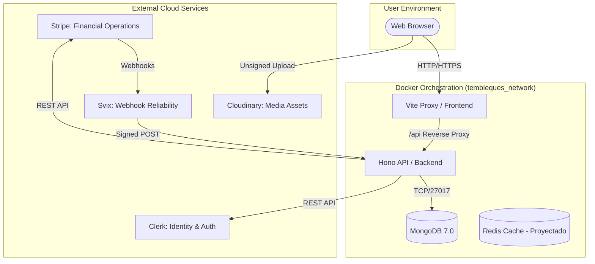
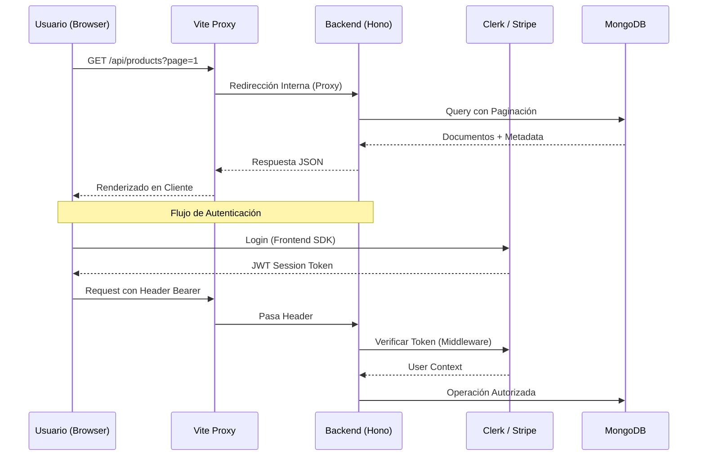

# Arquitectura Técnica: Tembleques Camila

Este documento detalla la arquitectura de software, la infraestructura y el flujo de datos de la plataforma Tembleques Camila. El sistema ha sido diseñado bajo los principios de escalabilidad, rendimiento extremo y gestión de estados asíncronos robusta, utilizando un stack moderno basado en **React 19**, **Bun** y **Hono**.

---

## 1. Visión General del Sistema

Tembleques Camila no es solo un e-commerce; es una aplicación web de misión crítica diseñada para digitalizar un proceso tradicional de alquiler folclórico. La arquitectura se basa en una separación clara de responsabilidades, orquestada mediante contenedores Docker para garantizar la paridad entre los entornos de desarrollo, staging y producción.

### Objetivos Arquitectónicos
- **Latencia Mínima**: Uso de Bun y Hono para una respuesta del servidor casi instantánea.
- **Estado Asíncrono Robusto**: Gestión de pagos y disponibilidad en tiempo real.
- **Escalabilidad Horizontal**: Servicios desacoplados listos para ser escalados independientemente.
- **Integridad de Datos**: Esquemas estrictos de Mongoose y validación Zod en todas las capas.

---

## 2. Diagrama de Infraestructura Global

El ecosistema de Tembleques Camila reside en una red virtual de Docker (`tembleques_network`), donde cada servicio está aislado pero interconectado mediante un sistema de nombres de DNS interno.



---

## 3. Desglose del Stack Tecnológico

### A. Frontend: La Revolución de React 19
El frontend utiliza **React 19**, aprovechando las nuevas capacidades de renderizado y el manejo simplificado de transacciones.
- **Vite 6**: Actúa como el motor de construcción (bundler) y servidor de desarrollo. Una pieza clave de nuestra arquitectura es el **Vite Proxy**, que redirige todas las peticiones al path `/api` hacia el backend en el puerto 3000, eliminando problemas de CORS en desarrollo y simplificando la configuración de red.
- **React Router v7**: Gestiona la navegación y la sincronización de estados con la URL (Rutas de Verdad).
- **Tailwind CSS v4**: Motor de estilos de última generación para una UI premium y de alto rendimiento.

### B. Backend: Bun + Hono
Elegimos **Bun** como runtime por su velocidad de ejecución y su ecosistema integrado (test runner, bundler, package manager). 
- **Hono**: Un framework ultra-ligero y rápido que nos permite definir rutas con tipado fuerte. Su arquitectura basada en middlewares nos permite inyectar seguridad (Clerk), validación (Zod) y registro de logs de forma modular.
- **Zod**: Garantiza que ningún dato malformado llegue a la base de datos, validando tanto las entradas del usuario como las respuestas de servicios externos.

### C. Persistencia: MongoDB 7
Utilizamos **MongoDB** para una gestión flexible de productos folclóricos que tienen atributos variables. La integración se realiza mediante **Mongoose**, que nos proporciona una capa de abstracción orientada a objetos (ODM) con validaciones y hooks de ciclo de vida.

---

## 4. Flujo de Datos y Comunicación Interna

La comunicación entre el cliente y el servidor sigue un patrón estricto de orquestación asíncrona.



---

## 5. Orquestación y Contenedores

El proyecto se despliega mediante **Docker Compose**, lo que nos permite levantar todo el entorno con un solo comando.

### Definición de Servicios (docker-compose.yml)
1.  **Frontend**: Expone el puerto 5173. Depende del backend para asegurar que la API esté lista antes de que el frontend intente realizar peticiones.
2.  **Backend**: Expone el puerto 3000. Utiliza un volumen para los logs y depende de la base de datos.
3.  **MongoDB**: Utiliza una imagen oficial de MongoDB 7.0 con un volumen persistente (`mongodb_data`) para evitar la pérdida de datos entre reinicios.

### El Rol del Proxy de Vite
En desarrollo, Vite intercepta las peticiones:
```javascript
// vite.config.ts (Concepto)
proxy: {
  '/api': {
    target: 'http://backend:3000',
    changeOrigin: true,
  }
}
```
Esto permite que el frontend hable con `/api/products` como si estuviera en el mismo dominio, mientras que Docker redirige esa petición al contenedor del backend de forma transparente.

---

## 6. Gestión de Estados Asíncronos

La plataforma maneja tres tipos de estados asíncronos críticos:

1.  **Disponibilidad de Productos**: Validada en tiempo real mediante un motor que consulta solapamientos de fechas en MongoDB.
2.  **Ciclo de Vida de Reservas**: Una máquina de estados (Pending -> Paid -> Confirmed -> Delivered -> Returned) que garantiza que el flujo de negocio se respete.
3.  **Confirmaciones Financieras (Webhooks)**: El backend no confirma un pago basándose en la redirección del frontend; espera una señal firmada de Stripe a través de Svix.

---

## 7. Estructura de Directorios y Responsabilidades

```text
parcial-dsix/
├── docs/                  # Documentación técnica modular
├── backend/               # Servicio de API
│   ├── src/
│   │   ├── models/        # Esquemas de datos (Product, Rental, etc.)
│   │   ├── routes/        # Definición de Endpoints y Middlewares
│   │   ├── services/      # Lógica de negocio (Availability, Stripe, Rental)
│   │   └── index.ts       # Punto de entrada y orquestación de Hono
├── frontend/              # Aplicación de cliente
│   ├── src/
│   │   ├── components/    # Átomos y moléculas de UI
│   │   ├── pages/         # Vistas principales y paneles admin
│   │   ├── services/      # Cliente API Axios/Fetch
│   │   └── hooks/         # Lógica de UI y sincronización URL
└── docker-compose.yml     # Orquestador maestro
```

---

## 8. Escalabilidad y Futuro

La arquitectura actual permite una evolución fluida hacia:
- **Microservicios**: Separar el panel de admin de la tienda cliente si el tráfico lo requiere.
- **Edge Computing**: Hono está diseñado para correr en el Edge (Cloudflare Workers), lo que permitiría una latencia global aún menor.
- **Multi-tenant**: La base de datos y la autenticación (Clerk) están preparadas para soportar múltiples tiendas bajo la misma infraestructura si fuera necesario.

---

## 9. Seguridad Arquitectónica

1.  **Validación de Origen**: Los webhooks de Stripe se validan mediante firmas criptográficas proporcionadas por Svix.
2.  **Protección de Rutas**: Middlewares de Hono interceptan cada petición al backend para validar el token de Clerk y el rol del usuario (Admin/User).
3.  **Aislamiento de Secretos**: Todas las credenciales sensibles se inyectan a través de variables de entorno, nunca se hardcodean en el repositorio.

---

Este documento es una guía viva de la ingeniería detrás de Tembleques Camila. Para detalles de implementación específicos, consultar los módulos de `BACKEND_DEEP_DIVE.md` y `FRONTEND_DEEP_DIVE.md`.
