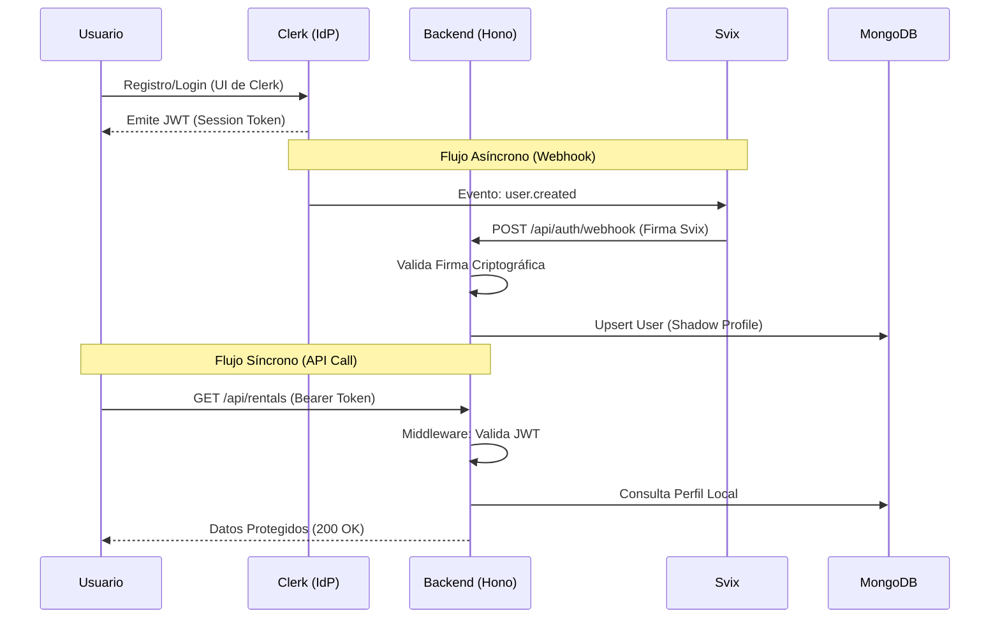
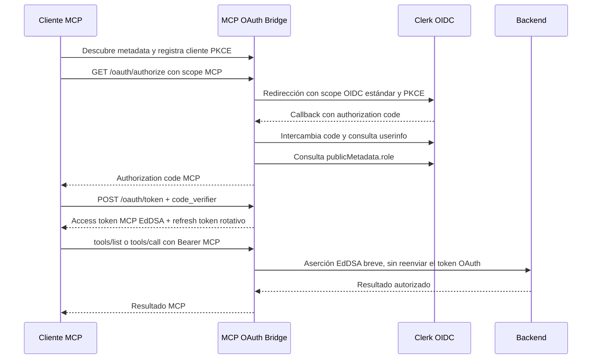

# Flujos Críticos: Identidad y Autenticación (Auth Flow)

Este documento describe la arquitectura de seguridad y gestión de identidades de Tembleques Camila. Utilizamos un modelo de **Identidad Delegada** basado en **Clerk**, sincronizado mediante webhooks con **MongoDB** para mantener la integridad referencial.

---

## 1. Arquitectura de Identidad Delegada

En lugar de gestionar contraseñas, sesiones y hashing localmente (un riesgo masivo de SecOps), delegamos la autenticación a **Clerk**.

### El Modelo de Confianza
1.  **Frontend**: El cliente de React habla directamente con Clerk para el login/registro. Clerk emite un **JWT (Short-lived Token)**.
2.  **Backend**: El servidor de Hono no conoce la contraseña del usuario. Solo confía en peticiones que incluyan un JWT válido firmado por la clave pública de Clerk.
3.  **Base de Datos**: MongoDB mantiene un "perfil sombra" del usuario (`clerkId`, `email`, `role`) para asociar reservas y pedidos sin duplicar la lógica de sesión.

---

## 2. Ciclo de Vida del Registro y Sincronización



---

## 3. Anatomía del Middleware de Autenticación

El archivo `middleware/auth.ts` es el guardián de la API. Realiza las siguientes operaciones críticas en cada petición protegida:

1.  **Extracción**: Obtiene el token del header `Authorization: Bearer <token>`.
2.  **Validación**: Utiliza la clave secreta de Clerk para verificar que el token no ha sido manipulado y que no ha expirado.
3.  **Inyección de Contexto**: Extrae el `clerkId` del payload del JWT.
4.  **Upsert Preventivo**: Si el usuario no existe en MongoDB (por ejemplo, si el webhook aún no ha llegado), el middleware descarga el perfil de Clerk y lo crea en ese instante. Esto elimina cualquier "Race Condition" en el primer acceso.

---

## 4. Sincronización vía Webhooks (Svix)

Para que el sistema sea resiliente, el endpoint `/api/auth/webhook` utiliza **Svix** para validar la legitimidad de los eventos enviados por Clerk.

### Estándares de Validación
El backend rechaza cualquier petición que no incluya los headers de seguridad de Svix:
- `svix-id`: ID único del mensaje.
- `svix-timestamp`: Previene ataques de replay (el mensaje expira tras 5 minutos).
- `svix-signature`: Firma HMAC SHA256 que garantiza que Clerk es el remitente.

```typescript
// Implementación en routes/auth.ts
const wh = new Webhook(WEBHOOK_SECRET);
event = wh.verify(rawBody, {
  "svix-id": svixId,
  "svix-timestamp": svixTimestamp,
  "svix-signature": svixSignature,
});
```

---

## 5. Gestión de Roles (RBAC)

La autorización se basa en el campo `role` (`client`, `owner`, `operator`, `inventory` o `support`).

1.  **Source of Truth**: El rol se define en el `publicMetadata` del usuario dentro del dashboard de Clerk.
2.  **Propagación**: El rol viaja dentro de los claims del JWT y también se sincroniza en el campo `role` de la colección `users` en MongoDB.
3.  **Protección de Rutas**: Utilizamos permisos por operación para bloquear el acceso a la API administrativa. `requireAdmin` se conserva como alias histórico para el permiso mínimo del dashboard:

```typescript
export const requireAdmin = async (c: Context, next: Next) => {
  const user = c.get("user");
  if (!hasPermission(user.role, "dashboard.read")) {
    throw new AppError("Acceso denegado", 403, "AUTH_FORBIDDEN");
  }
  await next();
};
```

---

## 6. Lógica de Respaldo y Recuperación

### Endpoint `/api/auth/me`
Este endpoint no solo devuelve los datos del usuario, sino que actúa como un **Sincronizador Activo**. Cada vez que un usuario carga su perfil, el backend consulta a Clerk para ver si hubo un cambio de rol manual. Si hay una discrepancia, MongoDB se actualiza automáticamente. Esto garantiza que un cambio de permisos se refleje incluso si los webhooks fallan.

---

## 7. Experiencia de Carga y Mitigación de FOUC (UX)

Para garantizar una experiencia **Premium**, hemos implementado una capa de mitigación contra el **FOUC (Flash of Unauthenticated Content)**.

### El Problema
Debido a la naturaleza asíncrona de la hidratación de Clerk y la posterior consulta del perfil en MongoDB, existe un lapso de tiempo donde la aplicación no sabe si el usuario está autenticado o no. Sin mitigación, la UI renderizaba brevemente el estado "Invitado" (botones de Login/Registro) antes de saltar al estado "Usuario".

### La Solución: GlobalAuthLoader
Implementamos un interceptor global en el punto de entrada de la aplicación (`App.tsx`) que:
1.  **Bloquea el Renderizado**: No monta las rutas ni los layouts hasta que `isLoaded` (Clerk) e `isLoading` (Profile Sync) son finales.
2.  **SplashScreen Premium**: Muestra una pantalla de carga elegante (Silent Luxury) con animaciones suaves que actúan como un puente visual mientras se resuelven las credenciales.

---

Este diseño de SecOps asegura que Tembleques Camila cumpla con estándares modernos de privacidad y seguridad, eliminando la responsabilidad de gestionar credenciales críticas en nuestra infraestructura.

## 8. OAuth para clientes MCP

Los clientes de IA no usan el JWT de sesión del frontend ni una API key administrativa. El endpoint MCP anuncia un bridge OAuth propio:



Clerk no recibe los scopes de negocio del MCP porque su Authorization Server solo admite scopes OIDC estándar. El bridge valida la firma y el `nonce` del `id_token`, confirma el `sub` mediante `userinfo`, resuelve el rol actual en Clerk y emite únicamente los scopes permitidos para ese rol. Los access tokens MCP duran poco; los refresh tokens se rotan y pueden revocarse. Las transacciones se almacenan temporalmente en memoria en staging, por lo que un reinicio requiere volver a autorizar.
