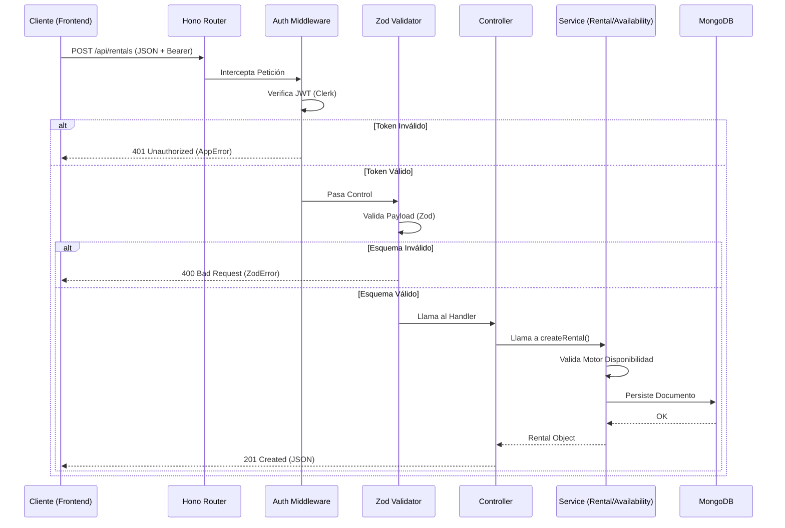

# Ingeniería de Backend: Profundización Técnica

Este documento proporciona una inmersión profunda en la arquitectura del servidor de Tembleques Camila. Está diseñado para ingenieros de backend que necesitan entender la anatomía del código, el flujo de datos y la lógica de negocio crítica implementada en **Hono** y **Bun**.

---

## 1. Ciclo de Vida de una Petición HTTP

Cada petición que llega al backend atraviesa una serie de capas de middleware antes de ser procesada por la lógica de negocio. Este diseño garantiza que la seguridad y la validación sean transversales.



---

## 2. Anatomía de Middlewares y Protección

### A. Middleware de Autenticación (`auth.ts`)
Utilizamos el SDK de Clerk para validar la identidad. No solo verificamos el token, sino que realizamos un "Upsert" del usuario en nuestra base de datos local para mantener la integridad referencial.

```typescript
export const authMiddleware = async (c: Context, next: Next) => {
  const authHeader = c.req.header("Authorization");
  if (!authHeader?.startsWith("Bearer ")) {
    throw new AppError("Token requerido", 401, "AUTH_TOKEN_REQUIRED");
  }

  const token = authHeader.split(" ")[1];
  try {
    const payload = await verifyToken(token, { secretKey: process.env.CLERK_SECRET_KEY! });
    const clerkId = payload.sub;

    // Sincronización con DB Local
    let user = await User.findOne({ clerkId });
    if (!user) {
      const clerkUser = await clerkClient.users.getUser(clerkId);
      user = await User.create({
        clerkId,
        email: clerkUser.emailAddresses[0].emailAddress,
        role: clerkUser.publicMetadata?.role || "user"
      });
    }
    c.set("user", user); // Inyectar usuario en el contexto
    await next();
  } catch (e) {
    throw new AppError("Sesión expirada", 401, "AUTH_TOKEN_INVALID");
  }
};
```

---

## 3. Manejo de Errores Profesional

### A. La Clase `AppError`
Extendemos la clase nativa `Error` para añadir semántica HTTP y códigos internos.

```typescript
export class AppError extends Error {
  constructor(
    public readonly message: string,
    public readonly statusCode: number = 400,
    public readonly code?: string
  ) {
    super(message);
    this.name = "AppError";
    Object.setPrototypeOf(this, new.target.prototype);
  }
}
```

### B. Handler Global (`app.onError`)
Capturamos todos los fallos en un único punto para evitar fugas de información.

```typescript
app.onError((err, c) => {
  if (err instanceof AppError) {
    return c.json({ error: err.message, code: err.code }, err.statusCode as any);
  }

  if (err instanceof ZodError) {
    const message = err.issues[0]?.message ?? "Error de validación";
    return c.json({ error: message, code: "VALIDATION_ERROR" }, 400);
  }

  console.error("[Server Internal Error]", err);
  return c.json({ error: "Error interno del servidor", code: "INTERNAL_ERROR" }, 500);
});
```

---

## 4. Lógica de Negocio Crítica

### A. Motor de Disponibilidad (`availability.ts`)
El motor de disponibilidad no realiza una búsqueda simple; gestiona la **concurrencia de stock**.

**Algoritmo de Concurrencia:**
1.  Busca todas las reservas activas que solapen con el rango solicitado.
2.  Itera día por día dentro del rango solicitado.
3.  Calcula cuántas reservas existen para ese día específico.
4.  Si en algún día el conteo es `>=` al stock de la variante, el producto se marca como no disponible.

```typescript
while (currentDay <= endDay) {
  let activeRentalsCount = 0;
  for (const rental of conflictingRentals) {
    if (currentDay >= rental.startDate && currentDay <= rental.endDate) {
      activeRentalsCount++;
    }
  }
  if (activeRentalsCount >= variant.stock) return false; // Stock agotado en este día
  currentDay.setDate(currentDay.getDate() + 1);
}
```

### B. Regla de Corte de las 6:00 PM (Panamá Offset)
Para evitar que un cliente reserve "para mañana" cuando ya es demasiado tarde logísticamente, aplicamos un bloqueo basado en el tiempo de Panamá (UTC-5).

```typescript
const now = new Date();
const panamaTime = new Date(now.getTime() - 5 * 60 * 60 * 1000);
const isPast6pm = panamaTime.getUTCHours() >= 18;

const minAllowedDate = new Date(panamaToday);
// Si es tarde, la reserva mínima es en T+2 (pasado mañana)
minAllowedDate.setDate(minAllowedDate.getDate() + (isPast6pm ? 2 : 1));

if (requestedStartDate < minAllowedDate) {
  throw new AppError("Reserva fuera del horario permitido", 400);
}
```

---

## 5. Validación de Payloads con Zod

Hono integra Zod mediante un middleware que intercepta el cuerpo de la petición antes de ejecutar el controlador.

```typescript
const createRentalSchema = z.object({
  productId: z.string().min(1, "ID requerido"),
  startDate: z.string().datetime(),
  endDate: z.string().datetime(),
  selectedSize: z.string()
});

// En el router:
rentals.post("/", async (c) => {
  const body = await c.req.json();
  const data = createRentalSchema.parse(body); // Valida y tipa automáticamente
  // ... lógica
});
```

---

## 6. Arquitectura de Servicios Asíncronos

El backend sigue el patrón de **Servicios Apátridas**:
- **Controllers**: Manejan la entrada/salida HTTP.
- **Services**: Contienen la lógica pura (Stripe, Disponibilidad, Cálculos).
- **Models**: Definen la estructura y hooks de persistencia.

Esta separación permite que los tests unitarios (`bun test`) puedan validar la lógica de servicios sin necesidad de levantar un servidor HTTP completo.

---

Este documento sirve como base técnica para cualquier contribución al servidor. Recuerde siempre lanzar `AppError` para mantener la consistencia en el manejo de excepciones.
