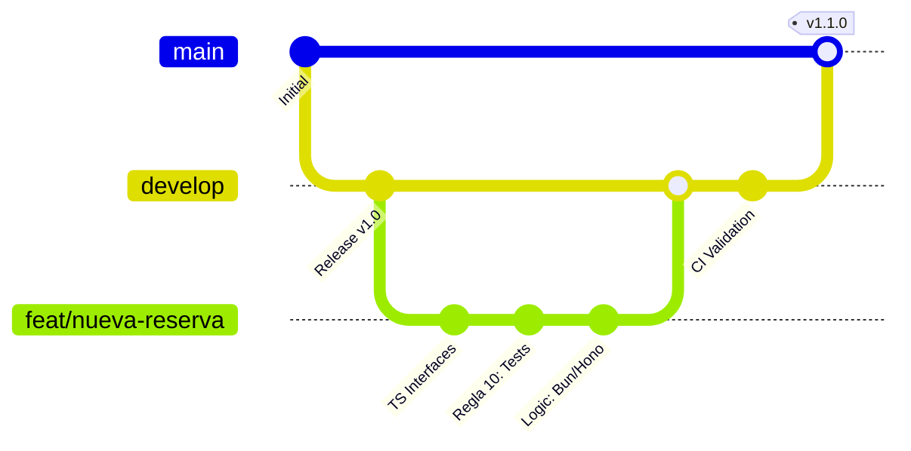

# Guía de Contribución: Tembleques Camila

Esta guía establece los estándares innegociables para contribuir al proyecto Tembleques Camila. Seguir estas directrices no es una sugerencia; es un requisito para que cualquier código sea revisado y aceptado en el repositorio. La excelencia técnica y la coherencia arquitectónica son nuestras prioridades absolutas.

---

## 1. Ciclo de Vida de una Feature

Cada funcionalidad o corrección debe seguir este flujo estricto para garantizar la estabilidad de la rama principal.



---

## 2. Flujo de Trabajo de Git

Utilizamos un modelo de **Git Flow simplificado**.

### A. Ramas Principales
- **`main`**: Solo contiene código estable y listo para producción. Cada merge a `main` debe ser etiquetado con una versión (SemVer).
- **`develop`**: Es la rama de integración. Todo el desarrollo se basa en esta rama.

### B. Ramas Temporales
- **`feat/nombre-funcionalidad`**: Para nuevas características.
- **`fix/descripcion-error`**: Para corrección de bugs.
- **`docs/mejora-documentacion`**: Para cambios exclusivos en archivos `.md`.

### C. Reglas de Ramas
1. **Nunca** trabajes directamente en `main` o `develop`.
2. Las ramas deben mantenerse actualizadas con `develop` mediante **rebase**, no merge, para mantener un historial limpio.
3. Al finalizar, abre un Pull Request (PR) hacia `develop`.

---

## 3. Estándares de Commits (Regla 03)

El historial de Git debe ser legible, profesional y libre de ruido visual.

### Formato Obligatorio
Usamos el estándar de **Conventional Commits**:
`<tipo>(<ámbito>): <descripción>`

- **`feat`**: Una nueva funcionalidad.
- **`fix`**: Una corrección de error.
- **`docs`**: Cambios en la documentación.
- **`refactor`**: Cambio en el código que no corrige un error ni añade una funcionalidad.
- **`test`**: Añadir o corregir pruebas.

### Prohibiciones Estrictas
> [!IMPORTANT]
> **Queda terminantemente prohibido el uso de emojis** en los mensajes de commit. Los mensajes deben ser puramente textuales y en español.

**Ejemplos:**
- ✅ `feat(rentals): implementar cálculo de mora diaria`
- ✅ `fix(auth): corregir expiración de token en Clerk`
- ❌ `feat(ui): Nuevo botón 🚀` (No emojis)
- ❌ `Arreglado el error` (No cumple con el formato)

---

## 4. Estándares de Código y TypeScript (Regla 01)

### A. Tipado Estricto
- **Prohibido el uso de `any`**. Si un tipo es desconocido, usa `unknown` y realiza una aserción de tipo o guarda de tipo.
- Define interfaces o tipos para todas las props de componentes, estados y respuestas de API.
- Utiliza las utilidades de TypeScript (`Pick`, `Omit`, `Partial`) para evitar la duplicación de definiciones.

### B. Convenciones de Nomenclatura
- **Variables y Funciones**: `camelCase` (ej. `getAvailableStock`).
- **Clases y Componentes**: `PascalCase` (ej. `ReservationForm`).
- **Constantes y Enums**: `UPPER_SNAKE_CASE` (ej. `MAX_RENTAL_DAYS`).
- **Archivos**: `PascalCase` para componentes (`ProductCard.tsx`) y `camelCase` para servicios o utilidades (`stripe.ts`).

### C. Estilo de Código
- Mantén las funciones pequeñas y con una única responsabilidad (Principio SRP).
- No uses comentarios para explicar "qué" hace el código (el código debe ser auto-descriptivo); úsalos para explicar el "por qué" en casos de lógica compleja.

---

## 5. Criterios de Aceptación de Code Review

Todo PR será revisado exhaustivamente. Un revisor tiene la potestad de rechazar un PR si no cumple con lo siguiente:

### Razones de Rechazo Automático
1. Presencia de `any` en archivos TypeScript.
2. Mensajes de commit con emojis o sin formato convencional.
3. Ausencia de pruebas unitarias para lógica de negocio nueva (Regla 10).
4. Código que rompe los tests existentes (`bun test`).
5. Uso de `alert()` o `console.log()` en código final.
6. Falta de manejo de errores mediante `AppError` en el backend.

### Qué buscamos en una Revisión
- **Legibilidad**: ¿Es fácil de entender por otro desarrollador?
- **Eficiencia**: ¿Hay operaciones innecesarias en bucles o consultas a la DB?
- **Seguridad**: ¿Se están exponiendo datos sensibles o hay huecos en la validación?

---

## 6. Testing y Calidad (Regla 10)

No aceptamos código que no haya sido validado.

### Ejecución de Pruebas
Utilizamos el test runner nativo de **Bun**.
```bash
# Ejecutar todos los tests
bun test

# Ejecutar tests con cobertura
bun test --coverage
```

### Requerimientos de Cobertura
- La lógica de servicios en `backend/src/services` debe tener una cobertura mínima del **80%**.
- Los componentes críticos del frontend (Checkout, Calendario) deben tener tests de integración.

### Linting, Formateo y Verificación de Tipos
- **Tipado Estricto (Frontend)**: Es obligatorio ejecutar `cd frontend && bun x tsc --noEmit` antes de realizar cualquier commit. Si este comando devuelve errores, el código no será aceptado.
- **Linting**: Ejecuta `bun run lint` antes de cada commit.
- **Formateo**: El proyecto utiliza Prettier para mantener un estilo visual consistente. No subas código mal formateado.

---

## 7. Proceso de Pull Request

1. **Título del PR**: Debe seguir el formato de los commits (ej. `feat(api): añadir endpoint de salud`).
2. **Descripción**:
   - Resume **qué** se ha hecho.
   - Indica **cómo** probar los cambios.
   - Enlaza el Issue relacionado si existe.
   - Adjunta capturas de pantalla si hay cambios en la UI.
3. **Checklist Pre-vuelo**:
   - [ ] He ejecutado `bun test` y todos pasan.
   - [ ] He verificado el tipado estricto (`bun x tsc --noEmit` sin errores).
   - [ ] No he usado emojis en mis commits.
   - [ ] He documentado cualquier nueva variable de entorno en `.env.example`.

---

## 8. Comunicación y Reporte de Problemas

- Si encuentras un bug, abre un **Issue** con una descripción clara, pasos para reproducir y el comportamiento esperado.
- Para sugerencias de arquitectura, utiliza las discusiones del repositorio o abre un ADR (Architecture Decision Record) en `docs/ADRS.md`.

---

Gracias por ayudar a que Tembleques Camila sea una plataforma técnica de primer nivel. Tu rigor y profesionalismo son lo que hace grande a este proyecto.
