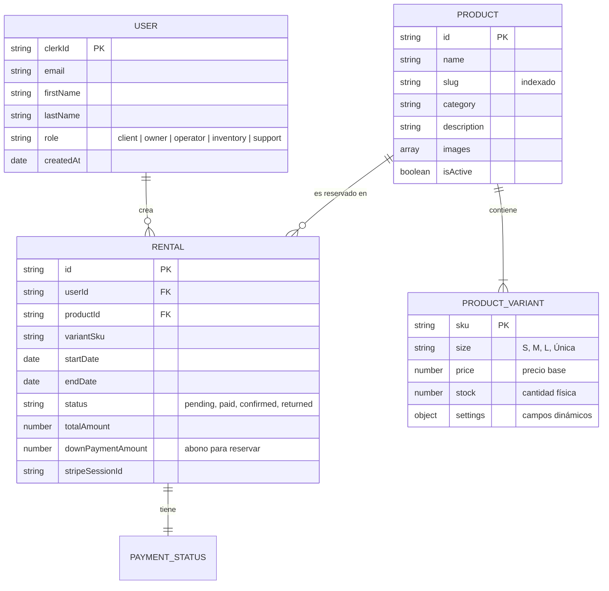

# Arquitectura de Persistencia: Tembleques Camila

Este documento detalla el diseño de la base de datos de Tembleques Camila, utilizando **MongoDB 7.0** y **Mongoose**. El sistema ha sido diseñado para manejar la complejidad de productos folclóricos con variantes dinámicas y un flujo de reservas basado en disponibilidad temporal.

---

## 1. Diagrama Entidad-Relación (ER)

Aunque MongoDB es una base de datos documental (NoSQL), existen relaciones lógicas y referencias que definen la integridad del sistema.



---

## 2. Diccionario de Colecciones

### A. Colección: `users`
Almacena la información de perfil sincronizada desde Clerk.
- **Campos Críticos**:
    - `clerkId` (String, Unique): Identificador maestro para la sincronización con el IdP.
    - `role` (String): Define los permisos operativos. El prefijo de rutas administrativas (`/admin`) es una convención de API y no un rol.
- **Integridad**: Esta colección se actualiza mediante webhooks. Si un usuario se elimina en Clerk, un hook de Svix dispara el borrado lógico o físico en esta colección.

### B. Colección: `products`
El corazón del catálogo folclórico. Utiliza un modelo de documento rico para evitar JOINs.
- **Arquitectura de Variantes**: En lugar de tener una tabla de "Stock", cada producto tiene un array de `variants`. 
    - **Por qué**: Las variantes de una pollera (talla, material) son intrínsecas al producto. Almacenarlas anidadas permite recuperar todo el estado de compra en una sola query.
- **Campos Dinámicos**: El objeto `settings` permite que diferentes tipos de productos (joyas vs. vestidos) tengan metadatos distintos sin cambiar el esquema global.

### C. Colección: `rentals` (Reservas)
Registra el ciclo de vida de un alquiler.
- **Campos de Control**:
    - `startDate` / `endDate`: Almacenados en ISO para validaciones de solapamiento.
    - `stripeSessionId`: Referencia única para la reconciliación financiera en el webhook de Stripe.
    - `downPaymentAmount`: El monto pagado inicialmente para separar el producto.

---

## 3. Lógica de Tallas y Variantes

La arquitectura de Tembleques Camila resuelve el problema de los productos únicos y de stock múltiple mediante un **Sistema de Variantes por SKU**.

### Estructura de Documento (Ejemplo)
```json
{
  "_id": "64f1...",
  "name": "Pollera de Gala",
  "variants": [
    {
      "sku": "POL-GALA-S",
      "size": "S",
      "price": 450,
      "stock": 2,
      "active": true
    },
    {
      "sku": "POL-GALA-M",
      "size": "M",
      "price": 475,
      "stock": 1,
      "active": true
    }
  ]
}
```

**Impacto en la Disponibilidad**:
Cuando se consulta la disponibilidad, el motor no solo busca el `productId`, sino que filtra por la `variantSku` dentro de las reservas activas para ese rango de fechas. Si el número de reservas activas es igual al `stock` definido en la variante, el producto se marca como "No Disponible".

---

## 4. Sistema de Abono (Reserva) y Precios

Se ha transicionado de un modelo de depósito de garantía a un modelo de **Abono para Separación**.
- **Abono de Reserva**: Un monto inicial (configurado por el administrador o calculado porcentualmente) que el cliente paga para asegurar que el producto sea retirado del catálogo para las fechas seleccionadas.
- **Saldo Pendiente**: La diferencia entre `totalAmount` y `downPaymentAmount`, que se gestiona en la entrega física del producto.
- **Penalidades**: Calculadas dinámicamente en el backend si la fecha actual supera a `endDate` en el momento de la devolución.

---

## 5. Estrategias de Indexación

Para garantizar respuestas en <100ms, hemos implementado los siguientes índices:

1.  **Índice Único en Slugs**: `products.createIndex({ slug: 1 }, { unique: true })`. Permite búsquedas rápidas en el catálogo por URL amigable.
2.  **Índice Compuesto en Reservas**: `rentals.createIndex({ productId: 1, startDate: 1, endDate: 1 })`. Vital para el motor de disponibilidad, permitiendo filtrar reservas que intersectan con las fechas deseadas.
3.  **Índice de Texto**: `products.createIndex({ name: "text", description: "text" })`. Utilizado para la búsqueda global en el frontend.

---

## 6. Integridad Referencial en NoSQL

Dado que MongoDB no fuerza claves foráneas, la integridad se gestiona en la capa de **Servicios (Hono)**:

- **Borrado Protegido**: No se puede eliminar un producto o una variante si existen reservas asociadas en estado `pending` o `paid`.
- **Sincronización de Slugs**: Si un administrador cambia el nombre de un producto, un `pre-save hook` de Mongoose regenera el slug. Las reservas antiguas mantienen la referencia por `productId` (ObjectId), por lo que el cambio de slug no rompe los historiales.
- **Consistencia de Precios**: Al crear una reserva, el precio se "congela" dentro del documento `rental`. Si el precio del producto sube mañana, la reserva ya pagada no se ve afectada (Arquitectura de Instantánea/Snapshot).

---

## 7. Manejo de Migraciones y Versionado de Esquemas

Cada esquema de Mongoose incluye la opción `{ timestamps: true }` y gestiona el versionado interno de MongoDB (`__v`). 
Para migraciones de datos masivas (como el cambio de sistema de tallas):
1.  Se crea un script de migración en `backend/src/scripts/migrations`.
2.  Se aplica una transformación `updateMany` con validación Zod previa para asegurar que ningún documento quede en estado inconsistente.

---

Este esquema es la base de la solidez operativa de Tembleques Camila. Para profundizar en cómo el servidor manipula estos datos, consulte `docs/BACKEND_DEEP_DIVE.md`.
