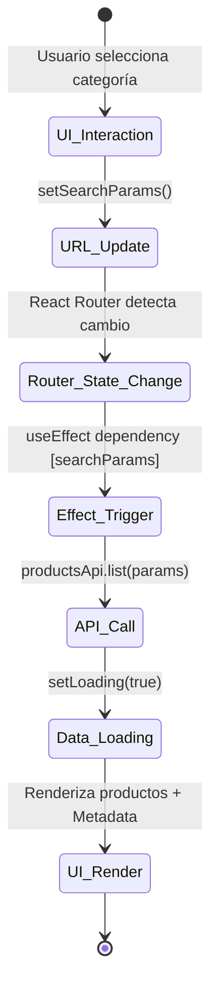

# Ingeniería de Frontend: Profundización Técnica

Este documento detalla la arquitectura del cliente de Tembleques Camila, centrada en **React 19**, **React Router v7** y una filosofía de **Estado en la URL** para garantizar una experiencia de usuario fluida y persistente.

---

## 1. El Paradigma de "Rutas de Verdad" (URL as Source of Truth)

En Tembleques Camila, el estado del catálogo (filtros, búsqueda y paginación) no reside en un `useState` volátil ni en un context global. El **Source of Truth** es la propia barra de direcciones.

### ¿Por qué esta arquitectura?
1.  **Compartibilidad**: Un usuario puede copiar la URL y enviarla a otro, quien verá exactamente los mismos resultados.
2.  **Historial Nativo**: Los botones de "atrás" y "adelante" del navegador funcionan de forma determinística.
3.  **Resiliencia**: Al recargar la página (`F5`), el estado se mantiene intacto.

### Implementación Técnica con `useSearchParams`
El componente `Catalog.tsx` utiliza el hook `useSearchParams` de React Router v7 para sincronizar cada interacción del usuario con la URL.

```typescript
const [searchParams, setSearchParams] = useSearchParams();

const handlePageChange = (page: number) => {
  const newParams = new URLSearchParams(searchParams);
  newParams.set("page", String(page));
  setSearchParams(newParams); // Esto dispara el re-render y el useEffect de carga
  window.scrollTo({ top: 0, behavior: 'smooth' });
};

const toggleCategory = (catId: string) => {
  const newParams = new URLSearchParams(searchParams);
  // Lógica multiselect en URL
  const current = newParams.getAll("category");
  if (current.includes(catId)) {
    const filtered = current.filter(x => x !== catId);
    newParams.delete("category");
    filtered.forEach(c => newParams.append("category", c));
  } else {
    newParams.append("category", catId);
  }
  newParams.set("page", "1"); // Resetear paginación al filtrar
  setSearchParams(newParams);
};
```

---

## 2. Diagrama de Flujo: Interacción y Reacción



---

## 3. Selector Inteligente de Tallas (Smart Size Selector)

El selector de tallas en `ProductDetail.tsx` no es un simple `select`. Es un motor de decisión que cruza tres fuentes de datos en tiempo real:
1.  **Esquema de Variantes**: Definido en el documento del producto.
2.  **Estado de Mantenimiento**: Flag `in_maintenance` por cada variante.
3.  **Disponibilidad Dinámica**: Datos del backend sobre reservas existentes en las fechas seleccionadas.

### Lógica de Filtrado de UI
```typescript
function getAvailableSizes(product: IProduct, bookedDates: any[]) {
  return product.variants.filter(variant => {
    // 1. Verificar stock base y mantenimiento
    if (variant.stock <= 0 || variant.in_maintenance) return false;

    // 2. Verificar solapamiento con fechas seleccionadas (Lógica de Frontend)
    const isBooked = bookedDates.some(booking => 
      booking.size === variant.size && 
      isDateOverlapping(selectedRange, booking.range)
    );
    
    return !isBooked;
  });
}
```

---

## 4. Gestión de Sesión e Inyección de Identidad (Clerk)

La integración con **Clerk** se maneja de forma centralizada para asegurar que cada petición segura lleve el JWT (JSON Web Token) actualizado.

### Patrón de Inyección de Token
Utilizamos un interceptor en nuestra instancia de Axios/Fetch que solicita el token a Clerk antes de cada disparo.

```typescript
// services/api.ts
import { useAuth } from "@clerk/clerk-react";

export const useApi = () => {
  const { getToken } = useAuth();

  const secureRequest = async (url: string, options: any) => {
    const token = await getToken(); // Clerk maneja el refresh automáticamente
    return fetch(url, {
      ...options,
      headers: {
        ...options.headers,
        Authorization: `Bearer ${token}`
      }
    });
  };

  return { secureRequest };
};
```

---

## 5. Carga de Datos en React Router v7

Aunque seguimos usando `useEffect` para cargas dinámicas en el catálogo, para las rutas de administración y perfil de usuario aplicamos los patrones de **Loaders** para evitar el "Layout Shift" y asegurar que la data esté lista antes de renderizar la página.

**Ventajas del Loader Pattern:**
- **Fetch-on-render vs Fetch-then-render**: El navegador empieza a descargar los datos en cuanto la URL cambia, no después de que el componente se monte.
- **Manejo de Errores**: Si el loader falla, el router redirige automáticamente a la `ErrorPage.tsx` definida, centralizando el manejo de fallos 404 o 500.

---

## 6. Troubleshooting de UI/UX

### A. El Misterio del "Calendario Atascado"
**Problema**: El selector de fechas de Radix UI a veces se renderizaba detrás de otros elementos o perdía el foco.
**Solución**: Implementamos un `Portal` dinámico y forzamos el `z-index` en el sistema de diseño para asegurar que el calendario siempre flote sobre el modal de reserva.

### B. Token Refresher (Infinite Loop)
**Problema**: En versiones iniciales, llamar a `getToken()` dentro de un `useEffect` sin las dependencias correctas causaba re-renders infinitos.
**Solución**: Se encapsuló la lógica de autenticación en un Context Provider propio que memoiza el token y solo refresca cuando Clerk emite un evento de cambio de sesión.

---

## 7. Estándares de Diseño y UI Premium

Seguimos una política estricta de **Mobile First**.
- **No dependencia de Hover**: Las acciones críticas (como ver el precio total) son visibles o accesibles mediante tap, nunca ocultas tras un hover (Regla 17).
- **Micro-animaciones**: Utilizamos `framer-motion` para transiciones suaves en la apertura de filtros y carga de tarjetas, mejorando la percepción de rendimiento.

---

Este documento es la guía definitiva para entender cómo el frontend de Tembleques Camila interactúa con el usuario y el servidor. La coherencia entre la URL y la UI es lo que define nuestra calidad de ingeniería.
