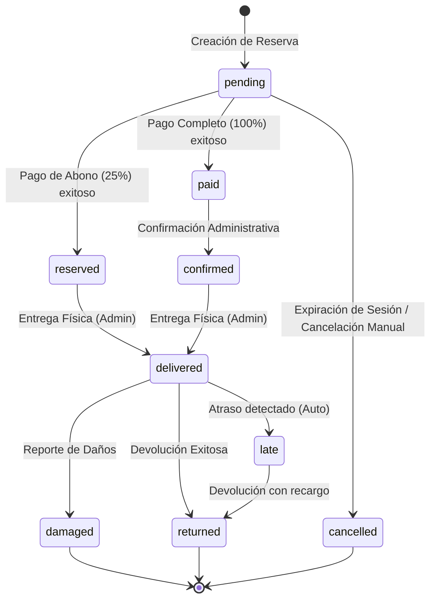
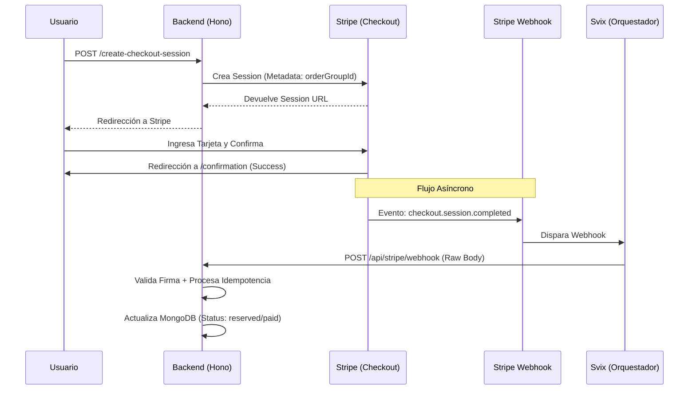

# Flujos Críticos: Pagos y Webhooks

Este documento detalla la arquitectura de procesamiento financiero de Tembleques Camila. Dado que este flujo maneja transacciones monetarias, la resiliencia, la idempotencia y la seguridad son los pilares fundamentales.

---

## 1. Máquina de Estados de la Reserva

El ciclo de vida de un alquiler es complejo y está regido por transiciones estrictas para evitar inconsistencias en el inventario y la contabilidad.



---

## 2. Ciclo de Vida del Checkout

El proceso de pago no termina cuando el usuario hace clic en "Pagar". Involucra una orquestación entre el cliente, el backend de Tembleques Camila, la infraestructura de Stripe y los webhooks de seguridad.



### Limpieza de Carritos Abandonados (Pedidos Colgados)

Para evitar que los usuarios bloqueen fechas del inventario sin completar el pago, se implementó un sistema de doble protección:

1. **Expiración Estricta en Stripe**: Al crear la sesión de Checkout (`createStripeSession`), se envía el parámetro `expires_at` configurado exactamente a **30 minutos** desde el momento actual. Si el usuario no paga en ese lapso, Stripe invalida el enlace y dispara el webhook `checkout.session.expired`, el cual nuestro backend intercepta para marcar la reserva como `cancelled`.
2. **Cron Job Local (Red de Seguridad)**: En caso de que el webhook de Stripe falle o el servidor sufra intermitencias, existe una tarea programada (`cron.ts`) que se ejecuta cada 5 minutos. Este script busca reservas en estado `pending` con más de 35 minutos de antigüedad y las cancela directamente en la base de datos.

### Smoke reproducible de expiración en staging

La validación operativa de esta historia se puede repetir desde terminal sin exponer credenciales. El comando ejecuta el script con las variables privadas inyectadas por Railway, crea una reserva técnica temporal usando datos disponibles, crea un Checkout Session de Stripe en modo test, solicita su expiración y espera la transición final de la reserva.

```bash
railway run --no-local --service backend --environment production -- bun run test:staging:expiration
```

El resultado esperado es un resumen seguro similar a:

```json
{
  "checkoutExpired": 200,
  "rentalStatus": "cancelled",
  "paymentStatus": "expired",
  "fixture": "temporary-staging-expiration"
}
```

La prueba debe ejecutarse únicamente contra el proyecto de staging vinculado a Railway y con claves de Stripe de prueba. No imprime tokens, claves, identificadores de sesión ni datos personales. Cada ejecución deja una reserva técnica sin pago en estado `cancelled`; por ello debe utilizarse como validación operativa controlada y no como tarea periódica de producción.

---

## 3. Seguridad y Validación con Svix

Utilizamos **Svix** como capa intermedia para garantizar que ningún evento de Stripe se pierda si nuestro servidor experimenta una caída temporal.

### Validación de Firmas
Hono debe recibir el cuerpo de la petición **exactamente** como lo envió Stripe (Raw Body). Si el cuerpo es parseado como JSON antes de la validación, la firma criptográfica fallará.

```typescript
// Implementación en routes/stripe.ts
stripe.post("/webhook", async (c) => {
  const sig = c.req.header("stripe-signature");
  const rawBody = await c.req.text(); // Extraer bytes puros

  // handleStripeWebhook utiliza stripe.webhooks.constructEvent
  const result = await handleStripeWebhook(rawBody, sig);
  return c.json(result);
});
```

---

## 4. Idempotencia y Resiliencia

### El problema de la "Race Condition"
Un usuario puede llegar a la página de `/confirmation` antes de que el webhook haya procesado el pago. 

**Soluciones implementadas:**
1.  **Endpoint de Verificación Síncrona**: El frontend llama a `/verify-session` inmediatamente. Este endpoint consulta a la API de Stripe en tiempo real para confirmar el estado antes de mostrar el éxito.
2.  **Lógica de Transición Protegida**: En el `RentalService`, cada cambio de estado verifica el estado actual. Si una reserva ya está como `paid` o `reserved`, el webhook ignora procesamientos duplicados.

---

## 5. Gestión de Atrasos y Cargos Automáticos

Para penalidades por retraso o daños, el sistema utiliza **Intenciones de Pago Off-Session**. 

1.  **Captura de Fuentes**: Durante el checkout inicial, solicitamos permiso para guardar el método de pago (`setup_future_usage: "off_session"`).
2.  **Cargos por Atraso**: Si el administrador marca una reserva como `late`, el backend calcula la mora y dispara un cargo automático a la tarjeta guardada sin intervención del usuario.
3.  **Abono de Reserva**: Al pagar solo el abono, el sistema registra el saldo pendiente (`balance_due`) que debe ser liquidado manualmente en la entrega física.

---

## 6. Modo Demo y Desarrollo Local

### Simulación (Demo Mode)
Si la variable `STRIPE_SECRET_KEY` no está configurada o es un placeholder, el sistema entra en **Demo Mode**.
- No se comunica con Stripe.
- Marca las reservas como pagadas instantáneamente.
- Genera IDs de sesión ficticios (`demo_session_...`).

### Stripe CLI para Local
Para probar webhooks en desarrollo local, los ingenieros deben usar el túnel de Stripe:
```bash
# Iniciar escucha de webhooks
stripe listen --forward-to localhost:3000/api/stripe/webhook
```
Esto genera una `webhook_secret` temporal que debe colocarse en el archivo `.env`.

---

## 7. Referencia de Errores Financieros

| Código | Razón | Acción Recomendada |
|---|---|---|
| `STRIPE_SESSION_NO_URL` | Stripe no pudo generar el Checkout | Verificar conexión y configuración de precios. |
| `STRIPE_WEBHOOK_INVALID_SIGNATURE` | La firma no coincide con el cuerpo | Asegurar que se está enviando el Raw Body. |
| `LATE_FEE_PAYMENT_METHOD_MISSING` | No hay tarjeta guardada para la mora | Contactar al cliente para pago manual. |

## 8. Operación financiera implementada en la fase 4

La fase 4 extendió este flujo con operaciones administrativas y controles posteriores al pago:

| Historia | Capacidad | Referencia operativa |
| --- | --- | --- |
| H43 — Reembolsos — issue #73 | Reembolso total o parcial con idempotencia, permisos administrativos y notificación de resultado. | `POST /api/admin/rentals/:id/refund` |
| H44 — Recibos — issue #74 | Comprobante PDF disponible únicamente para el propietario de la reserva. | `GET /api/rentals/:id/receipt.pdf` |
| H45 — Conciliación de pagos — issue #54 | Compara reservas internas con Checkout Session, PaymentIntent y evidencia del webhook. | `POST /api/admin/payments/reconcile` |
| H46 — Cancelaciones — issue #75 | Previsualiza la política y cancela aplicando el reembolso correspondiente. | `GET /api/rentals/:id/cancellation-preview` y `DELETE /api/rentals/:id` |
| H47 — Facturación fiscal preparada — issue #76 | Genera reportes académicos con subtotal, ITBMS, total y cobrado. | `/api/admin/reports/financial/export-csv` y `/api/admin/reports/financial/export.pdf` |

Los reportes financieros están marcados explícitamente como académicos y operativos. No son facturas fiscales electrónicas ni sustituyen una integración con la DGI.

La conciliación no se limita a listar reservas: para cada reserva con referencias Stripe consulta la Checkout Session, el PaymentIntent y el evento de webhook procesado. Puede detectar diferencias como:

- `MISSING_STRIPE_REFERENCE`.
- `AMOUNT_MISMATCH`.
- `PAYMENT_INTENT_NOT_SUCCEEDED`.
- `WEBHOOK_EVIDENCE_MISSING`.
- `CANCELLED_WITHOUT_REFUND`.
- `STRIPE_LOOKUP_FAILED`.

Las operaciones financieras administrativas requieren permisos específicos y deben ejecutarse con datos de prueba en ambientes no productivos.

## Notificaciones derivadas de pagos

Los eventos de confirmación, fallo, expiración, cancelación y reembolso pueden producir notificaciones internas. El canal de correo mediante Resend es opcional y se documenta en [Despliegue staging](./DEPLOY_STAGING.md); la ausencia del proveedor no cambia el estado financiero ni permite marcar un pago como confirmado.

---

Este documento es crítico para entender cómo Tembleques Camila protege su flujo de ingresos. Cualquier modificación en los controladores de Stripe debe ser validada contra esta máquina de estados.
