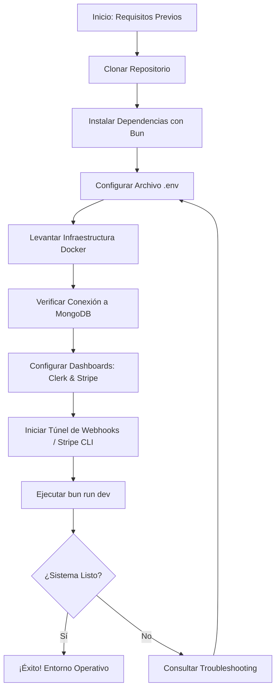

# Guía de Configuración del Entorno: Tembleques Camila

Esta guía proporciona un recorrido completo "Zero to Hero" para configurar el entorno de desarrollo de la plataforma Tembleques Camila. Al finalizar estos pasos, tendrás un ecosistema funcional con frontend, backend, base de datos y servicios de terceros (Clerk/Stripe/Cloudinary) sincronizados. Resend es opcional y solo es necesario si se quieren activar correos transaccionales reales.

---

## 1. Flujo Secuencial de Configuración

Sigue este diagrama para asegurar que el orden de instalación respete las dependencias del sistema.



---

## 2. Requisitos Previos y Herramientas Core

Antes de comenzar, asegúrate de tener instaladas las siguientes herramientas:

### A. Bun Runtime (Obligatorio)
Tembleques Camila utiliza **Bun** como motor principal de ejecución y gestor de paquetes (Regla 02). Bun es significativamente más rápido que npm o yarn y es vital para la ejecución de nuestros tests y scripts de servidor.
- **Instalación**:
  ```bash
  curl -fsSL https://bun.sh/install | bash
  ```
- **Verificación**: `bun --version`

### B. Docker & Docker Compose
Necesario para orquestar la base de datos MongoDB 7 y el entorno de red aislado.
- **Instalación**: Descarga Docker Desktop para Mac/Windows o instala Docker Engine en Linux.
- **Verificación**: `docker compose version`

### C. Stripe CLI (Recomendado)
Para redirigir eventos de pago directamente a tu backend local sin necesidad de túneles públicos complejos.
- **Instalación (macOS)**: `brew install stripe/stripe-cli/stripe`
- **Instalación (Linux/Win)**: Consulta la [documentación oficial de Stripe](https://stripe.com/docs/stripe-cli).

---

## 3. Instalación Paso a Paso

### Paso 1: Clonar y Preparar el Espacio de Trabajo
```bash
git clone <url-del-repositorio>
cd tembleques-camila-web
```

### Paso 2: Instalación de Dependencias
Ejecuta el instalador desde la raíz para que Bun configure los `node_modules` en ambos subproyectos:
```bash
bun install
```
*Nota: Este comando instalará las dependencias de `/frontend` y `/backend` de forma concurrente.*

### Paso 3: Configuración de Secretos (.env)
Copia el archivo de ejemplo y prepárate para editarlo:
```bash
cp .env.example .env
```
Abre el archivo `.env` y asegúrate de tener los valores mínimos para el arranque inicial. Por defecto, el sistema viene configurado para conectar con el contenedor de Docker:
```env
MONGO_URI=mongodb://mongodb:27017/tembleques_camila
VITE_API_URL=http://localhost:3000
```

---

## 4. Infraestructura de Datos (Docker)

Levantaremos la base de datos y verificaremos que el "health check" sea exitoso.

### Levantar MongoDB
```bash
docker compose up -d mongodb
```

### Verificación de Conexión
Para asegurarte de que el backend puede hablar con la base de datos, revisa que el contenedor esté corriendo y acepta conexiones:
```bash
docker ps
# Deberías ver el contenedor 'mongodb' en estado (healthy)
```

**Troubleshooting Común: Puerto 27017 ocupado**
Si recibes un error indicando que el puerto ya está en uso, es probable que tengas una instancia local de MongoDB corriendo fuera de Docker.
- **Solución**: Detén el servicio local (`brew services stop mongodb-community` en Mac) o cambia el mapeo de puertos en `docker-compose.yml`.

---

## 5. Configuración de Dashboards (Clerk & Stripe)

### A. Autenticación con Clerk
1. Crea una cuenta gratuita en [Clerk.com](https://clerk.com).
2. Crea una nueva aplicación llamada "Tembleques Dev".
3. En **API Keys**, copia la `Publishable Key` y la `Secret Key`.
4. Pégalas en tu `.env`:
   ```env
   VITE_CLERK_PUBLISHABLE_KEY=pk_test_...
   CLERK_SECRET_KEY=sk_test_...
   ```

### B. Pagos con Stripe (Modo Test)
1. Ve al [Dashboard de Stripe](https://dashboard.stripe.com) y activa el "Test Mode".
2. En **Developers > API Keys**, obtén tu `sk_test_...`.
3. Pégala en tu `.env`:
   ```env
   STRIPE_SECRET_KEY=sk_test_...
   ```
*Si dejas el placeholder por defecto, el sistema funcionará en **Modo Demo**, simulando los pagos sin contactar a Stripe.*

### C. Correo transaccional con Resend (Opcional)

Las notificaciones internas no dependen de Resend. Sin configuración adicional, el sistema crea la notificación dentro de la aplicación y registra el canal de correo como `skipped` con el código `EMAIL_PROVIDER_NOT_CONFIGURED`.

Para activar el envío real:

1. Crea o utiliza una cuenta de [Resend](https://resend.com).
2. Verifica el dominio o remitente que utilizarás.
3. Añade las siguientes variables al entorno protegido del backend:

   ```env
   RESEND_API_KEY=re_...
   RESEND_FROM_EMAIL=Tembleques Camila <notificaciones@tu-dominio-verificado.com>
   RESEND_REPLY_TO=contacto@tu-dominio-verificado.com
   ```

`RESEND_REPLY_TO` es opcional. La API key y cualquier valor real del remitente son secretos: no deben aparecer en Git, issues, logs ni capturas.

Cuando las variables están presentes, el backend registra el correo como `pending`, llama a Resend y lo cambia a `sent` o `failed`. La operación principal no queda bloqueada indefinidamente: la integración tiene un timeout interno de ocho segundos.

---

## 6. Desarrollo Colaborativo y Webhooks

Para que Clerk y Stripe puedan notificar a tu máquina local sobre nuevos usuarios o pagos exitosos, necesitamos un puente.

### Opción 1: Stripe CLI (Para Pagos)
Es la forma más robusta. Ejecuta en una terminal independiente:
```bash
stripe listen --forward-to localhost:3000/api/stripe/webhook
```
Copia el `Webhook Signing Secret` (`whsec_...`) que te entrega la terminal y ponlo en `STRIPE_WEBHOOK_SECRET` en tu `.env`.

### Opción 2: Localtunnel (Para Clerk y Pruebas Externas)
Si necesitas que Clerk envíe webhooks de sincronización de usuarios:
```bash
cd backend
bun run tunnel
```
Esto te dará una URL pública (ej. `https://tembleques-camila.loca.lt`). Configura esta URL en el dashboard de Clerk en la sección de Webhooks: `.../api/auth/webhook`.

---

## 7. Ejecución y Verificación Final

Una vez configurado todo el `.env`, inicia el sistema completo:
```bash
docker compose up --build
```

### Checklist de Salud
- [ ] Visita [http://localhost:5173](http://localhost:5173): El frontend debe cargar.
- [ ] Intenta Registrarte: Debes ver el modal de Clerk.
- [ ] Revisa los logs del backend: `docker compose logs -f backend`. No debe haber errores de conexión a MongoDB.
- [ ] Si activaste Resend, genera una notificación de prueba y confirma que el correo llegue al buzón previsto.
- [ ] Si no activaste Resend, confirma que la notificación interna funciona y que el canal de correo queda como `skipped`.

---

## 8. Troubleshooting Operativo Avanzado

### Problema: El Backend no reconoce cambios en el .env
**Causa**: Docker Compose cachea las variables en la creación del contenedor.
**Solución**: Fuerza la recreación:
```bash
docker compose up -d --force-recreate backend
```

### Problema: Error 401 "Unauthorized" persistente en el Frontend
**Causa**: Desincronización de relojes entre tu máquina y los servidores de Clerk.
**Solución**: Sincroniza la hora de tu sistema operativo o intenta cerrar sesión y volver a entrar.

### Problema: La Base de Datos está vacía tras el primer inicio
**Causa**: El script de seed no se ejecutó o falló.
**Solución**: Ejecuta el seed manualmente dentro del contenedor:
```bash
docker compose exec backend bun run src/seed.ts
```

---

## 9. Comandos de Supervivencia

| Acción | Comando |
| --- | --- |
| Ver logs de todo | `docker compose logs -f` |
| Ver logs del backend | `docker compose logs -f backend` |
| Reset total (borrar DB) | `docker compose down -v` |
| Reiniciar frontend | `docker compose restart frontend` |
| Ejecutar tests | `docker compose exec backend bun test` |

---

¡Felicidades! Tu entorno de Tembleques Camila está listo para el desarrollo. Si encuentras algún problema no documentado, por favor repórtalo en el canal de ingeniería para actualizar esta guía.
